# PLAY NEMONIC

> ### "하드웨어의 한계를 넘어, 웹에서 네모닉을 직접 경험합니다"
>
> 네모닉의 출력, 점착, 활용 경험을 3D 공간과 인터랙티브 콘텐츠로 옮겨
> 실물 기기가 없어도 누구나 즐길 수 있게 만든 Phygital 인터랙티브 사이트
>
- **서비스명**: PLAY NEMONIC
- **개발 기간**: 2026.04.06 ~ 2026.06.04
- **개발 인원**: 6명 (FE 3, BE 3)
- **서비스 목적**: 실제 네모닉 기기가 없어도 웹에서 출력 경험과 콘텐츠 활용성을 체험할 수 있는 사이트

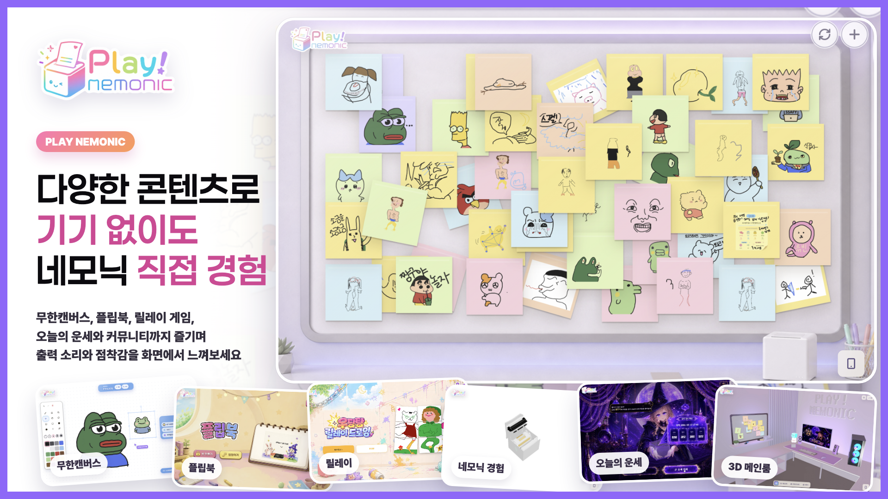

# 목차

- [기획 배경](#기획-배경)
- [서비스 소개](#서비스-소개)
- [주요 화면 및 기능 소개](#주요-화면-및-기능-소개)
- [프로젝트 핵심 기술](#프로젝트-핵심-기술)
- [시스템 아키텍처](#시스템-아키텍처)
- [프로젝트 구조](#프로젝트-구조)
- [기술 스택](#기술-스택)

# 기획 배경

네모닉은 디지털 데이터를 물리적인 점착 메모와 라벨로 즉시 변환하는 IoT 출력 디바이스입니다. 잉크가 필요 없는 감열식 출력, 점착 메모와 라벨을 오가는 폼팩터, 업무 도구와 교육 솔루션으로 확장되는 생태계를 갖추고 있지만, 실물 기기가 없는 사용자는 네모닉 특유의 즉각적이고 물리적인 경험에 접근하기 어렵습니다.

PLAY NEMONIC은 이 구매 전 체험 장벽을 낮추기 위해 기획되었습니다. 실제 기기를 보유하지 않아도 웹에서 네모닉의 핵심 흐름인 `출력 → 점착 → 활용`을 경험하게 만들고, 단순 제품 소개를 넘어 사용자가 직접 만들고 공유하는 가상의 체험 공간을 제공하는 것이 목표였습니다.

특히 10대와 20대 사용자가 흥미를 느낄 수 있도록 생성형 AI, 실시간 멀티플레이, 밈과 공유 중심의 콘텐츠를 결합했습니다. 이를 통해 네모닉이 가진 피지컬 출력 경험을 온라인에서도 직관적으로 이해하고, 자연스럽게 다시 방문하고 싶어지는 플레이그라운드로 확장하고자 했습니다.

# 서비스 소개

PLAY NEMONIC은 네모닉 기기의 출력 경험을 웹으로 옮긴 Phygital 인터랙티브 사이트입니다. 사용자는 3D 메인룸에서 콘텐츠를 선택하고, 무한캔버스, 플립북, 릴레이 드로잉, 오늘의 운세, 커뮤니티 보드 같은 콘텐츠를 즐기며 자신만의 결과물을 만들 수 있습니다.

완성된 결과물은 가상 네모닉 기기를 통해 출력되는 것처럼 표현됩니다. 출력 소리, 용지가 나오는 모션, 박스를 열어 결과물을 확인하는 과정, 메모가 커뮤니티 보드에 붙어 남는 흐름을 시각과 청각 인터랙션으로 구현해 실제 기기가 없어도 네모닉을 직접 사용하는 듯한 감각을 제공합니다.

즉, PLAY NEMONIC은 제품을 설명하는 페이지가 아니라 사용자가 그리고, 만들고, 뽑고, 붙이며 네모닉의 가능성을 먼저 경험하는 웹 기반 체험 사이트입니다.

# 주요 화면 및 기능 소개

## 3D 메인룸

<table>
  <tr>
    <th>전체 방</th>
    <th>콘텐츠 선택</th>
    <th>원격 모니터 이동</th>
  </tr>
  <tr>
    <td align="center"></td>
    <td align="center"></td>
    <td align="center"></td>
  </tr>
</table>

- 사용자는 3D 방 형태의 메인룸에서 네모닉 체험 사이트에 진입합니다.
- 모니터와 하단 탭을 통해 커뮤니티 보드, 무한캔버스, 플립북, 릴레이 드로잉, 운세, 네모닉 체험관으로 이동할 수 있습니다.
- Three.js 기반 3D 씬으로 서비스의 첫인상을 만들고, 실제 체험 공간에 들어온 듯한 몰입감을 제공합니다.

## 커뮤니티 보드

<table>
  <tr>
    <th>커뮤니티 보드</th>
    <th>커뮤니티 공유</th>
    <th>공유된 사진</th>
  </tr>
  <tr>
    <td align="center"></td>
    <td align="center">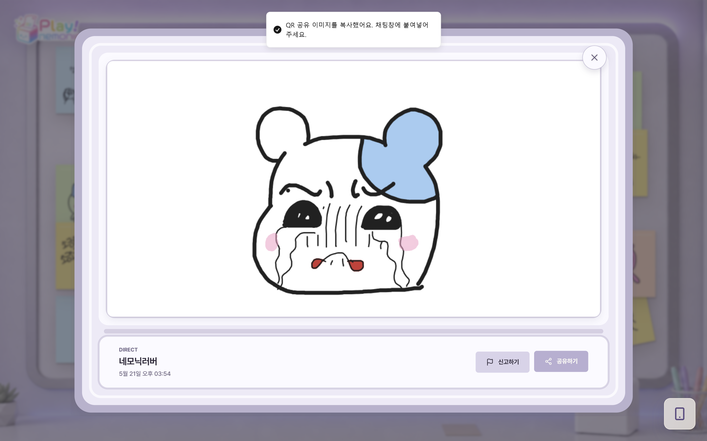</td>
    <td align="center"></td>
  </tr>
</table>

- 사용자는 직접 작성한 메모나 다른 콘텐츠에서 만든 결과물을 커뮤니티 보드에 붙일 수 있습니다.
- 공용 벽의 최대 부착 가능 메모 수는 백오피스에서 조정할 수 있으며, 기본 운영값은 약 70개로 설정했습니다.
- 커뮤니티에 붙인 메모는 공유 링크와 이미지로 외부에 공유할 수 있어, 사용자가 만든 결과물이 서비스 밖으로도 확산됩니다.
- 게시 전 OCR/텍스트 모더레이션으로 부적절한 콘텐츠 노출을 줄이고, 신고/삭제/상세 보기 흐름을 제공합니다.
- 결과물이 모이는 공간 자체가 전시장이 되도록, 네모닉 출력물이 벽에 남는 경험을 중심으로 설계했습니다.

## 네모닉 출력 체험관


- 실제 네모닉 기기가 없어도 웹에서 출력 과정을 체험할 수 있는 공간입니다.
- 사용자는 출력 박스를 열고, 종이가 출력되는 연출과 소리를 통해 기기 사용감을 간접 경험합니다.
- 갤러리 결과물을 다시 꺼내 출력하는 흐름을 제공해, 콘텐츠 제작과 출력 경험을 하나로 연결합니다.

## 무한캔버스

<table>
  <tr>
    <th>입장 화면</th>
    <th>그리기</th>
    <th>출력</th>
    <th>AI 스티커</th>
  </tr>
  <tr>
    <td align="center">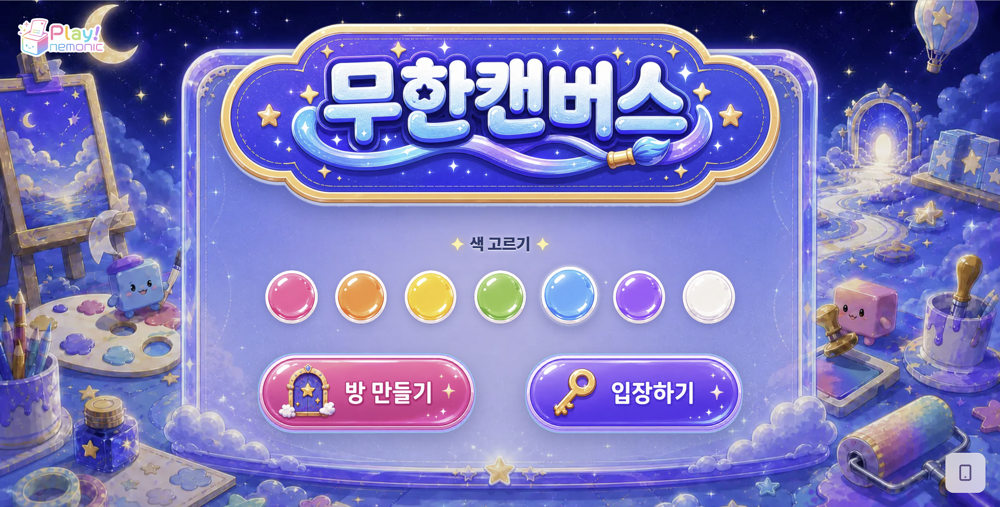</td>
    <td align="center"></td>
    <td align="center"></td>
    <td align="center">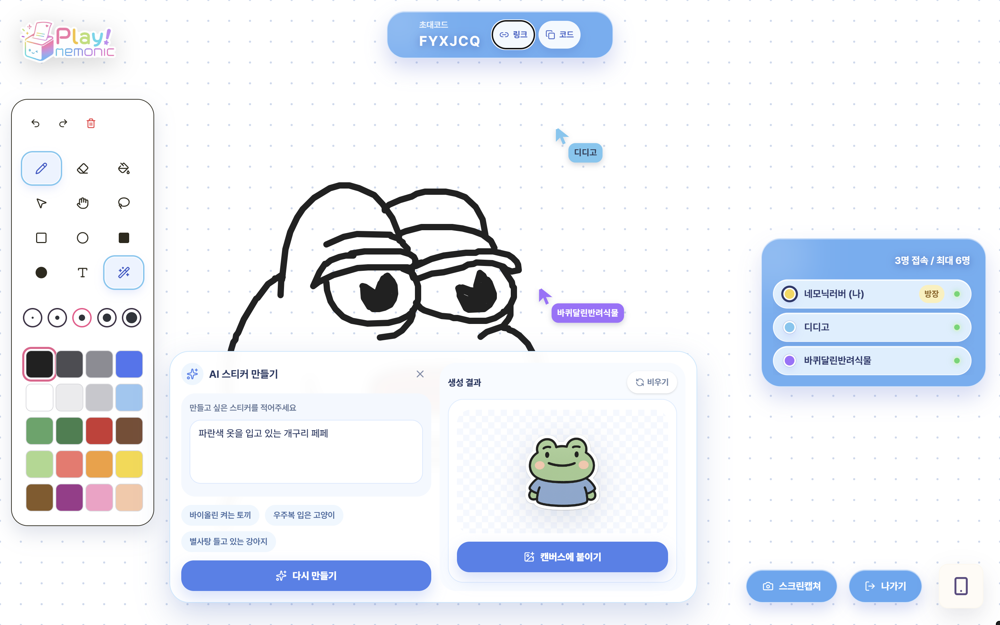</td>
  </tr>
</table>

- 여러 사용자가 같은 캔버스에 접속해 실시간으로 그림을 그리고 요소를 배치할 수 있습니다.
- WebSocket 기반 동기화로 참여자별 드로잉 상태를 공유하고, 방 상태는 Redis에 저장합니다.
- AI 스티커 생성, 캡처, 갤러리 저장, 커뮤니티 게시 흐름으로 이어집니다.
- 빈 방이나 방치된 방은 자동 정리되어 운영 리소스가 누적되지 않도록 설계했습니다.

## 플립북

<table>
  <tr>
    <th>입장 화면</th>
    <th>게임 진행</th>
    <th>결과 공개</th>
  </tr>
  <tr>
    <td valign="top">
      <p align="center">
        <br/><br/>
      </p>
      <ul>
        <li>참여자는 링크 또는 QR로 방에 입장해 프레임을 그립니다.</li>
        <li>방 생성 후 참여자를 기다리는 로비 흐름을 제공합니다.</li>
      </ul>
    </td>
    <td valign="top">
      <p align="center">
        <br/><br/>
      </p>
      <ul>
        <li>각 참여자가 맡은 프레임을 그려 움직임의 한 장면을 완성합니다.</li>
        <li>제출된 프레임은 순서대로 합쳐져 하나의 플립북이 됩니다.</li>
      </ul>
    </td>
    <td valign="top">
      <p align="center">
        <br/><br/>
      </p>
      <ul>
        <li>완성된 플립북은 갤러리에 저장하고 공유할 수 있습니다.</li>
        <li>네모닉 출력 체험과 연결해 결과물을 메모처럼 남길 수 있습니다.</li>
      </ul>
    </td>
  </tr>
</table>

## 우당탕 릴레이 드로잉

<table>
  <tr>
    <th>입장 화면</th>
    <th>게임 진행</th>
    <th>결과 화면</th>
  </tr>
  <tr>
    <td align="center"></td>
    <td align="center"></td>
    <td align="center">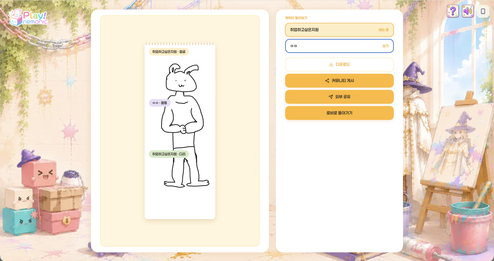</td>
  </tr>
</table>

- 참여자들이 얼굴, 몸통, 다리 파트를 나누어 그리고 다음 사람에게 캔버스를 넘깁니다.
- 이전 파트의 일부만 보고 이어 그리기 때문에 예측할 수 없는 캐릭터가 완성됩니다.
- 방코드, 공유 링크, QR 초대를 지원하며, 방장 이탈/참여자 재접속/자동 제출 정책을 포함합니다.
- 최종 결과물은 갤러리에 저장되고 커뮤니티 보드 게시로 이어집니다.

## 오늘의 운세


- 사용자의 생년월일 정보를 바탕으로 프론트엔드에서 만세력 라이브러리 결과를 계산합니다.
- 서버는 프론트엔드에서 받은 사주 데이터를 GMS API에 전달해 운세 풀이를 생성하고, 하루 1회 제한 정책을 적용합니다.
- 운세 카드 역시 갤러리와 커뮤니티 보드로 이어져 출력 가능한 콘텐츠가 됩니다.

## 백오피스

<table>
  <tr>
    <th>대시보드</th>
    <th>AI 프롬프트 관리</th>
    <th>콘텐츠 파라미터 조정</th>
  </tr>
  <tr>
    <td align="center">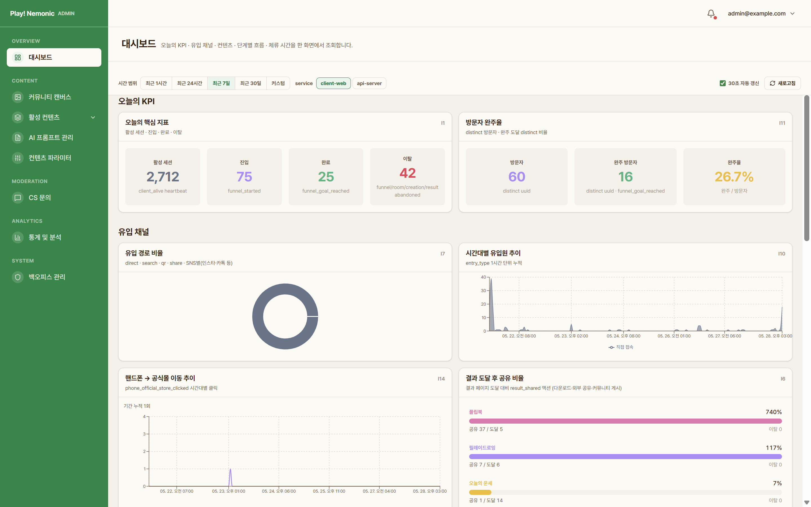</td>
    <td align="center">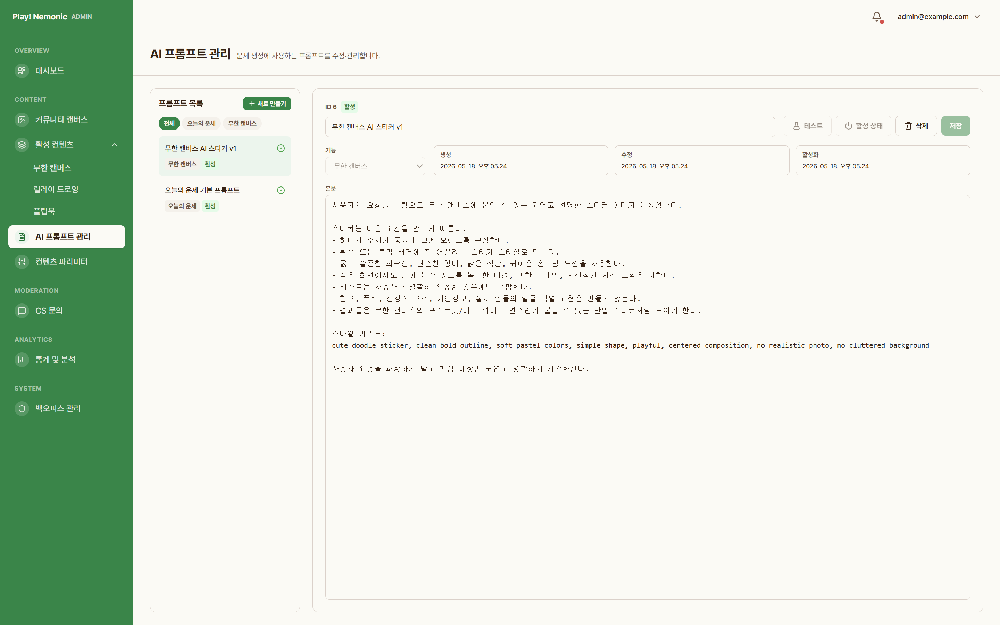</td>
    <td align="center">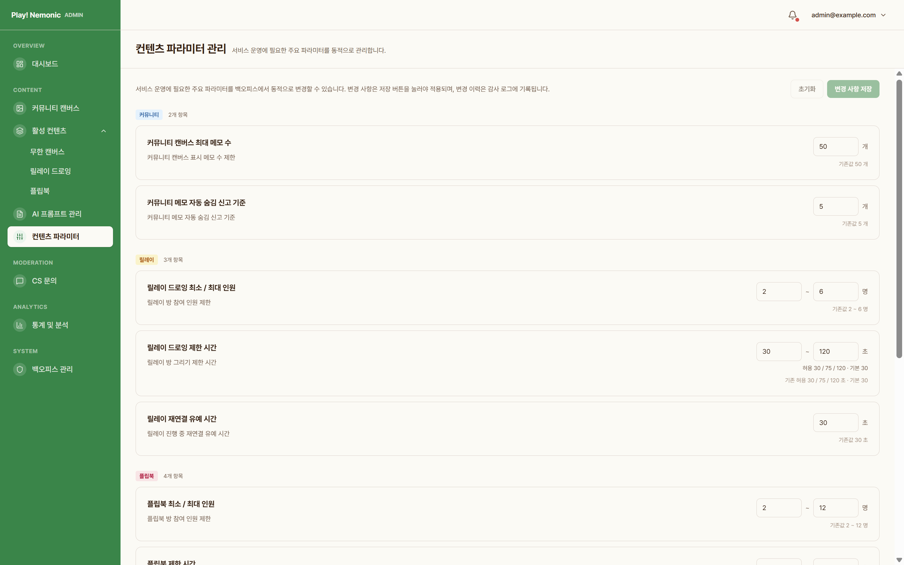</td>
  </tr>
</table>

<table>
  <tr>
    <th>활성 메모 확인</th>
    <th>슈퍼 관리자 계정 관리</th>
  </tr>
  <tr>
    <td align="center">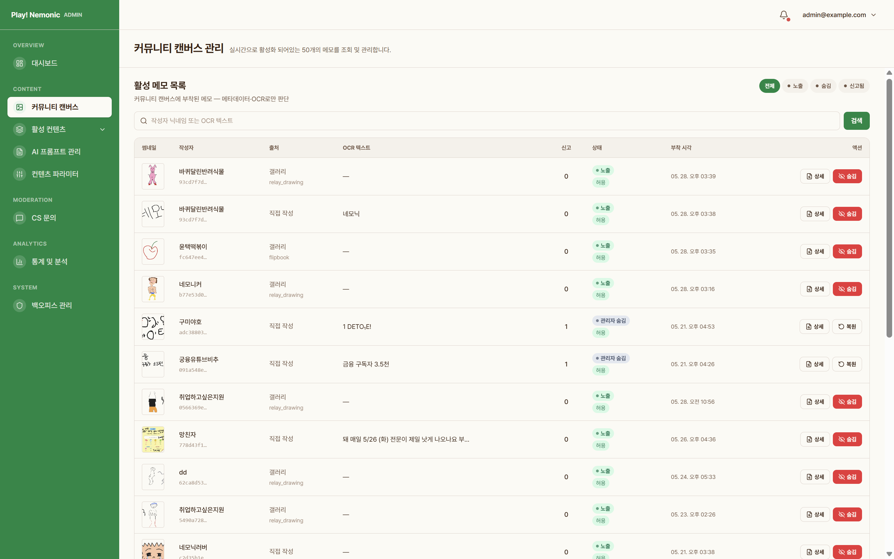</td>
    <td align="center">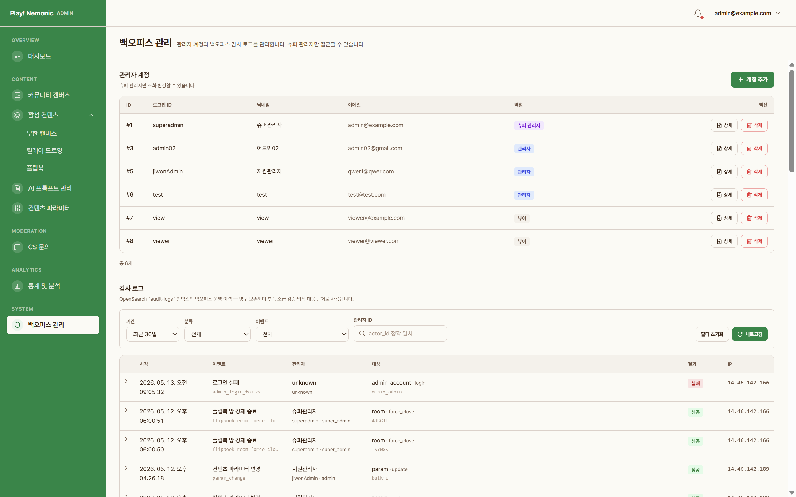</td>
  </tr>
</table>

- 운영자는 대시보드에서 사용자 활동, 콘텐츠 현황, 신고와 문의 상태를 확인합니다.
- AI 프롬프트와 콘텐츠 파라미터를 백오피스에서 조정해 운영 중에도 콘텐츠 품질을 관리할 수 있습니다.
- 활성 메모 확인, 커뮤니티 관리, 일반 관리자 계정 관리 기능을 통해 서비스 운영 권한을 분리했습니다.

# 프로젝트 핵심 기술

## 3D 체험 공간과 콘텐츠 라우팅


- `@react-three/fiber`, `@react-three/drei`, `@react-three/rapier`를 활용해 3D 메인룸과 인터랙션을 구현했습니다.
- 메인룸의 모니터, 오브젝트, 하단 탭을 서비스 콘텐츠 진입점으로 연결했습니다.
- 3D 씬은 `worlds/` 단위로 분리하고, 서비스 기능은 `features/` 단위로 관리해 화면 복잡도를 낮췄습니다.

## 실시간 멀티플레이 드로잉

| 콘텐츠 | 실시간 처리 | 저장 방식 |
| --- | --- | --- |
| 무한캔버스 | WebSocket 기반 요소/드로잉 동기화 | 활성 상태 Redis, 결과물 MinIO/PostgreSQL |
| 릴레이 드로잉 | 방/참여자/파트 진행 이벤트 동기화 | 진행 상태 Redis, 최종 산출물 PostgreSQL |
| 플립북 | 방/라운드/제출 상태 동기화 | 프레임 업로드 후 최종 결과물 생성 |

- STOMP/WebSocket을 통해 방 상태, 참여자 목록, 제출 상태, 결과 생성 흐름을 실시간으로 전달합니다.
- Redis에는 진행 중 상태를 저장하고, 최종 산출물은 MinIO와 PostgreSQL에 분리해 저장합니다.
- 방장 이탈, 재접속, 자동 제출, 종료 처리 등 멀티플레이에서 발생하는 예외 상황을 정책화했습니다.

## 산출물 · 갤러리 · 커뮤니티 게시 파이프라인

[Artifact 파이프라인 구성도 보기](./docs/artifact-pipeline.html)

- 사용자가 만든 결과물은 `artifact`로 관리되어 갤러리에서 다시 조회할 수 있습니다.
- 이미지 파일은 presigned URL로 MinIO에 직접 업로드하고, 서버는 파일 확정과 메타데이터를 관리합니다.
- 커뮤니티 게시 시에는 원본 artifact와 게시용 이미지 스냅샷을 분리해, 같은 결과물을 여러 방식으로 게시할 수 있습니다.

## AI 모더레이션과 콘텐츠 안전성

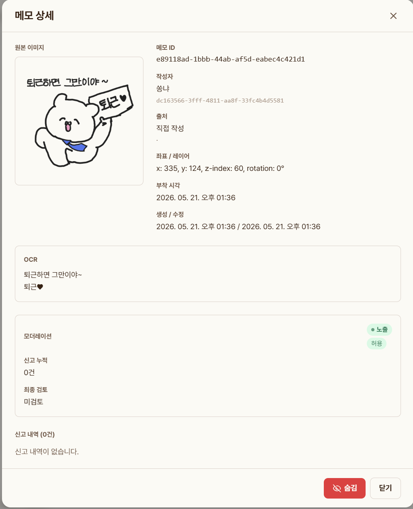

- 커뮤니티 메모 게시 전 텍스트와 이미지 기반 모더레이션을 수행해 부적절한 콘텐츠 노출을 줄입니다.
- FastAPI 기반 moderation server를 별도 서비스로 운영하며, 한국어 유해 표현 모델과 OCR 설정을 분리했습니다.
- 신고 누적, 자동 숨김, 운영자 복원/삭제를 백오피스에서 관리할 수 있도록 설계했습니다.

## 관측 가능성과 운영 백오피스

[로그 파이프라인 구성도 보기](./docs/log-pipeline.html)

- 프론트엔드 행동 로그와 백엔드 API/도메인 이벤트를 분리 수집해 중복 이벤트를 줄였습니다.
- Fluent Bit, Kafka, OpenSearch, Dashboards 기반 로그 파이프라인으로 접속, 전환, 오류, 감사 로그를 분석합니다.
- Prometheus/Grafana를 통해 서버 리소스와 WebSocket 연결 등 실시간 운영 지표를 확인합니다.

# 시스템 아키텍처

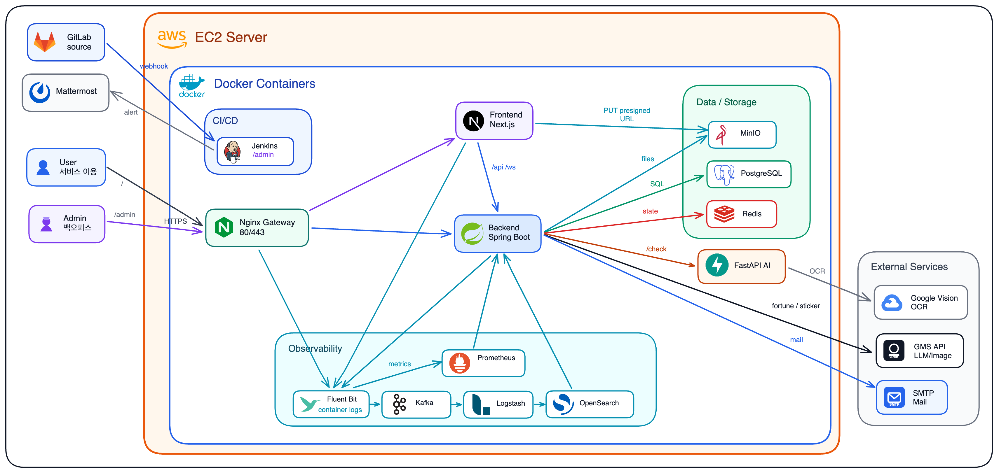

```text
User Browser
  ├─ Next.js Frontend
  │   ├─ 3D Room / Hub
  │   ├─ Drawing Contents
  │   └─ Admin Backoffice
  │
  └─ Spring Boot API
      ├─ PostgreSQL: 영구 데이터, 산출물 메타데이터, 관리자/감사 로그
      ├─ Redis: 실시간 방 상태, 참여자 상태, 캐시
      ├─ MinIO: 이미지, GIF, 결과물 파일
      ├─ FastAPI Moderation: AI 모더레이션 / OCR
      └─ OpenSearch Pipeline: 로그 수집과 운영 분석
```

# 프로젝트 구조

```text
S14P31S208/
├── frontend/                 # Next.js 16 서비스/백오피스 프론트엔드
│   └── src/
│       ├── app/              # 라우트 진입점
│       ├── worlds/           # 3D 씬
│       ├── features/         # 도메인 기능
│       └── shared/           # 공용 UI, API, 상태, 유틸
├── backend/                  # Spring Boot API 서버
│   ├── src/main/java/com/nemonicworld/
│   │   ├── community/        # 커뮤니티 보드
│   │   ├── infinitecanvas/   # 무한캔버스
│   │   ├── relay/            # 릴레이 드로잉
│   │   ├── flipbook/         # 플립북
│   │   ├── fortune/          # 오늘의 운세
│   │   ├── artifact/         # 산출물/갤러리
│   │   └── backoffice/       # 운영 백오피스
│   └── docs/                 # API, 제품 스펙, ADR, 성능 문서
├── ai/moderation-server/     # FastAPI 기반 콘텐츠 모더레이션 서버
├── deploy/                   # 배포 스크립트와 Nginx 설정
├── logging/                  # Fluent Bit/Kafka/OpenSearch 로그 파이프라인
├── monitoring/               # Prometheus/Grafana 설정
└── docs/                     # README용 화면 캡처, GIF, 썸네일
```

# 기술 스택

## Frontend

<div>
  
  
  
  
</div>
<div>
  
  
  
  
  
</div>

## Backend

<div>
  
  
  
  
  
</div>
<div>
  
  
  
  
</div>

## AI / Observability / Infra

<div>
  
  
  
  
  
</div>
<div>
  
  
  
  
  
</div>
