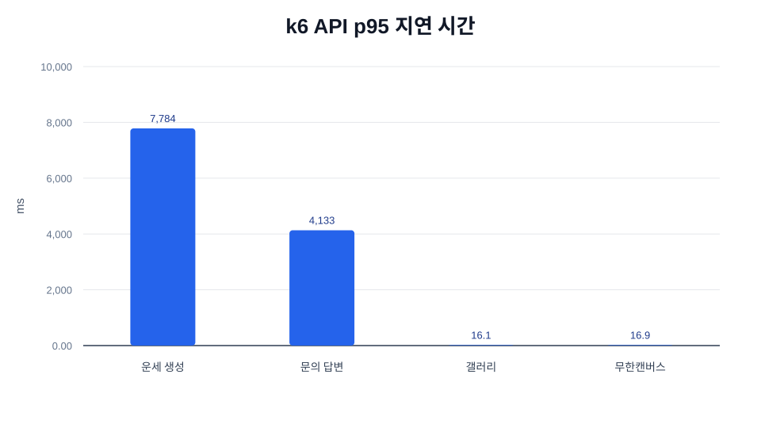
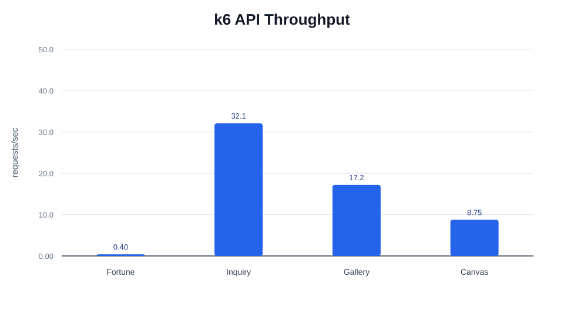

# k6 공통 요약 그래프

이 폴더는 트러블 슈팅별 k6 결과를 한눈에 비교하기 위한 공통 그래프를 보관합니다.

개별 k6 실행 파일과 raw 결과는 각 트러블 슈팅 폴더의 `k6/` 아래에 있습니다.

그래프 순서는 `01 운세 생성`, `02 문의 답변`, `03 갤러리`, `04 무한캔버스 활성 방 목록`입니다. 트러블 슈팅 5는 HTTP k6 대상이 아니라 synthetic benchmark 대상이라 공통 k6 그래프에서 제외했습니다.

## 그래프

| 그래프 | 한국어 | English |
| --- | --- | --- |
| API p95 지연 시간 | `graphs/k6-p95-latency-ko.svg` | `graphs/k6-p95-latency.svg` |
| API 처리량 | `graphs/k6-rps-ko.svg` | `graphs/k6-rps.svg` |

