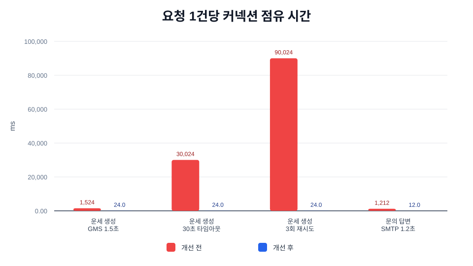
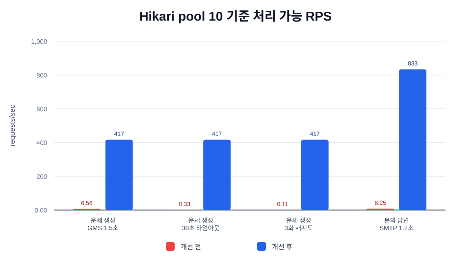
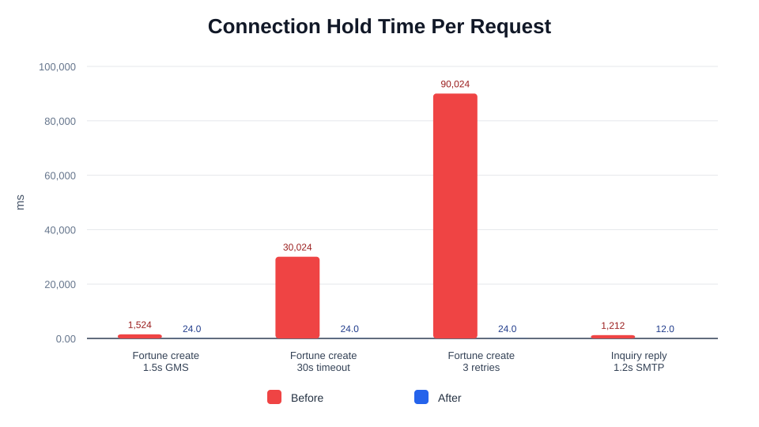
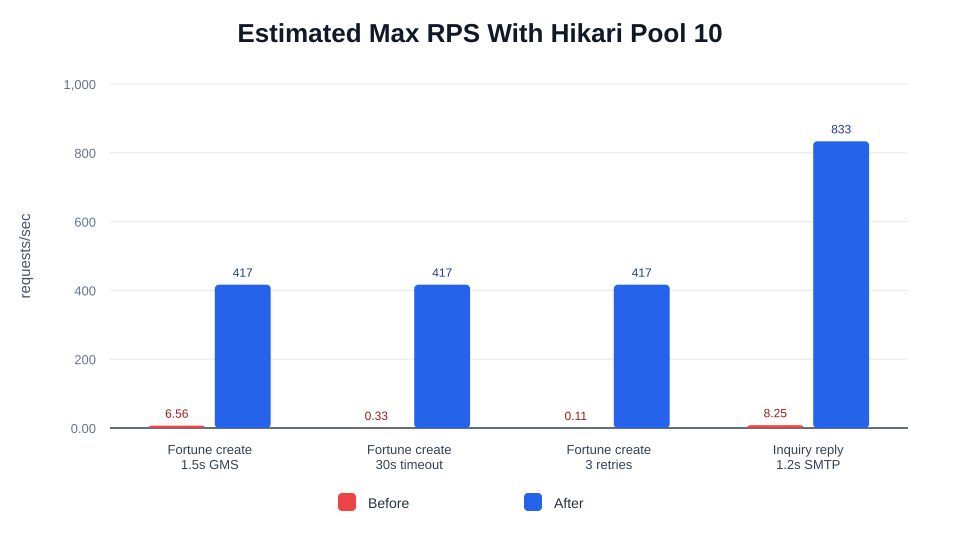

# 트러블 슈팅 1. 외부 I/O 트랜잭션 분리 성능 최적화 Before / After

## 요약

운세 생성/재조회와 문의 답변 API에서 외부 I/O가 Spring `@Transactional` 범위 안에 있던 구간을 분리했습니다.

적용한 최적화는 DB 쿼리를 빠르게 만든 것이 아니라, 느린 외부 호출 중 HikariCP 커넥션을 붙잡지 않도록 트랜잭션 경계를 줄인 작업입니다.

| 사용 기법 | 적용 위치 | 기대 효과 |
| --- | --- | --- |
| 트랜잭션 경계 축소 | 운세 생성, 운세 재조회, 문의 답변 | 외부 I/O 대기 중 DB 커넥션 점유 제거 |
| 커넥션 풀 병목 완화 | HikariCP | 동시 요청에서 `active/pending` 커넥션 증가 위험 감소 |
| 외부 API 격리 | GMS, MinIO, SMTP | timeout/retry가 DB transaction duration으로 전파되지 않음 |
| 수치화 | synthetic capacity model | before/after connection hold time, pool capacity 비교 |
| 관측 지표 | Actuator/Prometheus | `http.server.requests` p95/p99와 HikariCP metric으로 운영 검증 가능 |

<br>

## 자료 위치

| 구분 | 경로 |
| --- | --- |
| 최적화 문서 | `backend/docs/performance/01-외부-io-트랜잭션-분리.md` |
| 운세 생성 코드 | `backend/src/main/java/com/nemonicworld/fortune/service/fortune/FortuneCreateUseCase.java` |
| 운세 재조회 코드 | `backend/src/main/java/com/nemonicworld/fortune/service/fortune/FortuneTodayQueryUseCase.java` |
| 짧은 트랜잭션 지원 코드 | `backend/src/main/java/com/nemonicworld/fortune/service/fortune/FortuneTransactionSupport.java` |
| 문의 답변 코드 | `backend/src/main/java/com/nemonicworld/inquiry/service/admin/AdminInquiryCommandUseCase.java` |
| synthetic benchmark | `backend/scripts/benchmark-transaction-io-performance.py` |
| k6 실행 가이드 | `backend/docs/performance/06-k6-부하-테스트-실행-가이드.md` |
| k6 결과 요약 | `backend/docs/performance/05-k6-부하-테스트-결과.md` |
| 그래프 assets | `backend/docs/performance/assets/transaction-io-connection-hold-ko.svg`, `backend/docs/performance/assets/transaction-io-pool-capacity-ko.svg` |

## 사용한 k6

이 트러블 슈팅은 synthetic benchmark로 HikariCP 커넥션 점유 시간을 모델링하고, k6로 실제 HTTP 경로의 p95, p99, RPS, 실패율을 확인했습니다.

| 측정 대상 | k6 스크립트 | endpoint tag | 결과 파일 |
| --- | --- | --- | --- |
| 운세 생성 | `backend/scripts/k6/fortune-create-load.js` | `fortune_create` | `backend/docs/performance/k6-results/fortune-create-load.md` |
| 문의 답변 | `backend/scripts/k6/admin-inquiry-reply-load.js` | `admin_inquiry_reply` | `backend/docs/performance/k6-results/admin-inquiry-reply-load.md` |

운세 생성 실행 예시:

```bash
k6 run \
  -e BASE_URL=http://localhost:8080/api/v1 \
  -e VUS=10 \
  -e DURATION=1m \
  backend/scripts/k6/fortune-create-load.js
```

문의 답변 실행 예시:

```bash
k6 run \
  -e BASE_URL=http://localhost:8080/api/v1 \
  -e ADMIN_TOKEN=<관리자-access-token> \
  -e VUS=10 \
  -e DURATION=1m \
  backend/scripts/k6/admin-inquiry-reply-load.js
```

<br>

## 최적화 대상

### Before

기존 구조에서는 서비스 메서드 전체가 하나의 트랜잭션으로 묶여 있었습니다.

```text
DB 조회
-> GMS / MinIO / SMTP 외부 I/O
-> DB 저장 또는 갱신
-> transaction commit
```

이 구조에서는 첫 DB 접근 이후 외부 I/O가 끝날 때까지 커넥션이 반환되지 않을 수 있습니다. GMS 기본 read timeout은 `30,000ms`이고 운세 생성은 최대 `3회` 시도하므로, 장애 상황에서는 DB 작업이 거의 없어도 트랜잭션이 오래 유지될 수 있습니다.

### After

변경 후에는 외부 I/O를 트랜잭션 밖에서 실행하고, DB 쓰기만 짧은 트랜잭션으로 묶습니다.

```text
짧은 read transaction
-> GMS / MinIO / SMTP 외부 I/O
-> 짧은 write transaction
```

관련 코드:

- `FortuneCreateUseCase.createFortune(...)`
- `FortuneTodayQueryUseCase.getTodayFortune(...)`
- `FortuneTransactionSupport`
- `AdminInquiryCommandUseCase.replyInquiry(...)`

<br>

## Before / After 수치

측정은 운영 트래픽 실측이 아니라, 현재 코드의 트랜잭션 경계와 외부 latency 시나리오를 반영한 synthetic capacity model입니다. 절대값보다 “외부 I/O가 커넥션 점유 시간에 포함되는가”를 비교하기 위한 모델입니다.

```bash
python3 backend/scripts/benchmark-transaction-io-performance.py --output-dir backend/docs/performance/assets
```

가정:

- Hikari pool size: `10`
- 운세 생성 DB 구간: `24ms`
- 문의 답변 DB 구간: `12ms`
- GMS read timeout: `30,000ms`
- 운세 생성 최대 시도 횟수: `3회`

| 시나리오 | Before 커넥션 점유 | After 커넥션 점유 | 감소율 | Before 100건 커넥션-초 | After 100건 커넥션-초 | Before pool 10 RPS | After pool 10 RPS | 처리 여유 |
| --- | ---: | ---: | ---: | ---: | ---: | ---: | ---: | ---: |
| 운세 생성 - GMS 1.5초 성공 | 1,524.00ms | 24.00ms | 98.43% | 152.40s | 2.40s | 6.56 | 416.67 | 63.50x |
| 운세 생성 - GMS 30초 timeout | 30,024.00ms | 24.00ms | 99.92% | 3,002.40s | 2.40s | 0.33 | 416.67 | 1,251.00x |
| 운세 생성 - GMS 3회 timeout | 90,024.00ms | 24.00ms | 99.97% | 9,002.40s | 2.40s | 0.11 | 416.67 | 3,751.00x |
| 문의 답변 - SMTP 1.2초 | 1,212.00ms | 12.00ms | 99.01% | 121.20s | 1.20s | 8.25 | 833.33 | 101.00x |

### 한국어 그래프





### English Graphs





<br>

## 코드 변경 내용

### 운세 생성

`FortuneCreateUseCase.createFortune(...)`에서 메서드 전체 `@Transactional`을 제거했습니다. 중복 생성 여부 확인은 짧은 read transaction으로 수행하고, GMS 호출과 카드 렌더링/업로드는 트랜잭션 밖에서 실행합니다. `artifact`, `fortune_artifact`, `gallery` 저장은 `FortuneTransactionSupport.saveFortune(...)`에서 짧은 write transaction으로 묶어 기존 원자성을 유지했습니다.

### 운세 재조회

`FortuneTodayQueryUseCase.getTodayFortune(...)`에서 메서드 전체 `@Transactional`을 제거했습니다. 저장된 운세 조회는 read transaction으로 끝내고, 오래된 카드 이미지 재생성/MinIO 업로드는 트랜잭션 밖에서 수행합니다. 이미지 object key 갱신만 짧은 write transaction으로 처리합니다.

### 문의 답변

`AdminInquiryCommandUseCase.replyInquiry(...)`에서 메서드 전체 `@Transactional`을 제거했습니다. 문의 조회 후 SMTP 발송을 트랜잭션 밖에서 실행하고, 답변 상태 갱신은 짧은 JDBC update로 처리합니다. 기존에도 메일 발송 후 DB 상태를 갱신하는 순서였으므로 사용자 관점의 동작 순서는 유지됩니다.

<br>

## 운영 검증 지표

Actuator Prometheus가 노출되어 있고 `http.server.requests` histogram이 켜져 있으므로 다음 지표로 운영 before/after를 확인할 수 있습니다.

| 지표 | 볼 것 |
| --- | --- |
| `hikaricp_connections_active` | 운세/문의 트래픽 중 active connection이 pool size에 붙는지 |
| `hikaricp_connections_pending` | 커넥션 대기 요청이 생기는지 |
| `hikaricp_connections_timeout_total` | 커넥션 획득 timeout이 증가하는지 |
| `http_server_requests_seconds_bucket` | API p95/p99 latency가 외부 I/O 장애에 어떻게 반응하는지 |
| `fortune_gms_succeeded`, `fortune_gms_failed` 로그 | GMS latency와 retry가 커넥션 pool 압박으로 번지는지 |

<br>

## 검증

테스트에는 외부 호출 시점에 실제 Spring transaction이 열려 있지 않은지 확인하는 assertion을 추가했습니다.

```bash
cd backend
./gradlew --no-daemon test --tests com.nemonicworld.fortune.controller.FortuneControllerIntegrationTest --tests com.nemonicworld.inquiry.controller.AdminInquiryControllerIntegrationTest
```

추가로 전체 backend 검증을 실행했습니다.

```bash
cd backend
./gradlew --no-daemon spotlessCheck test bootJar
```

결과: `BUILD SUCCESSFUL`
