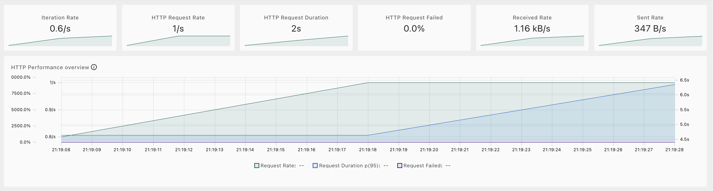
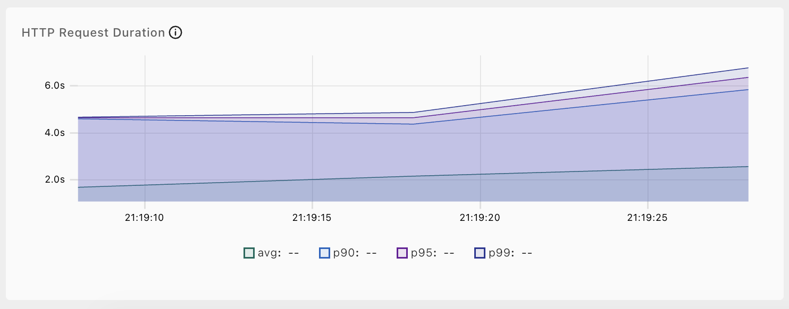
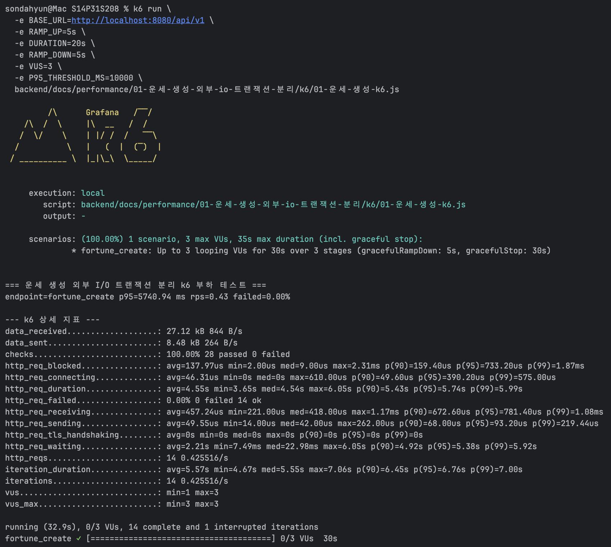
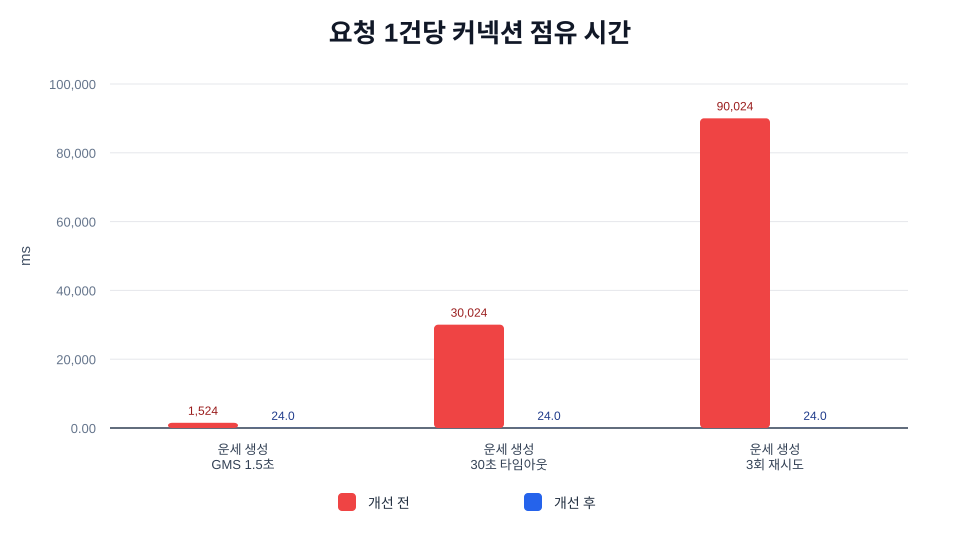
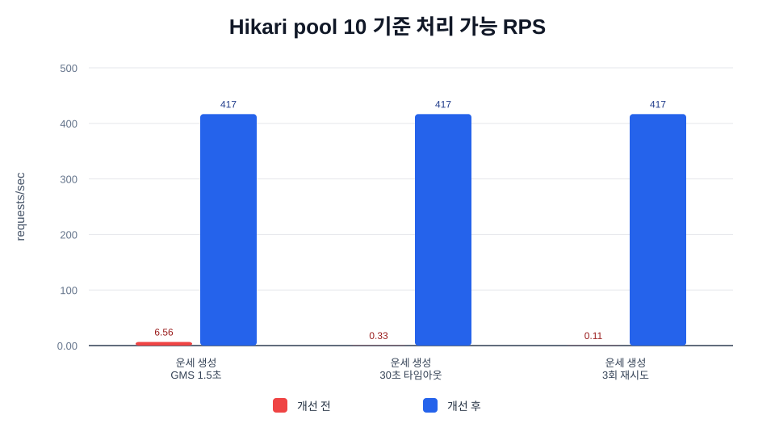
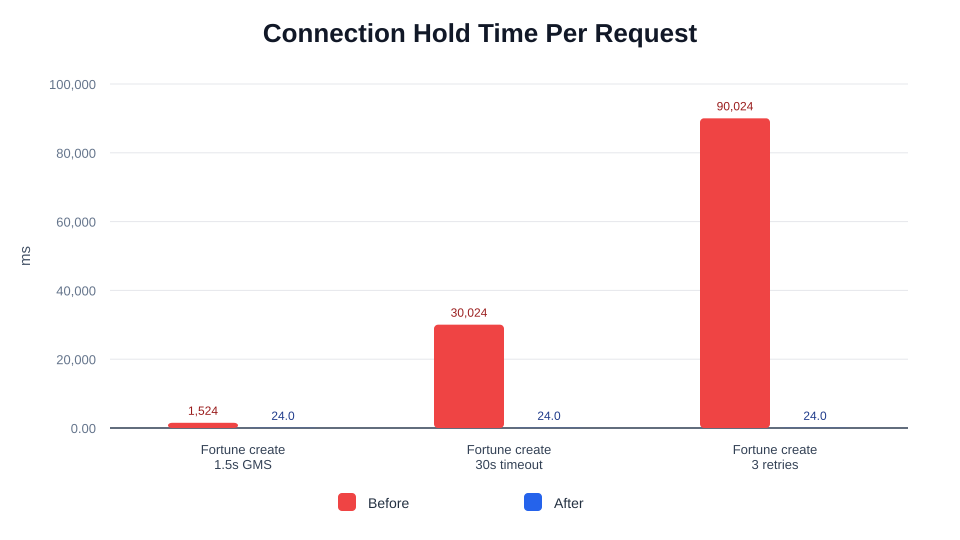
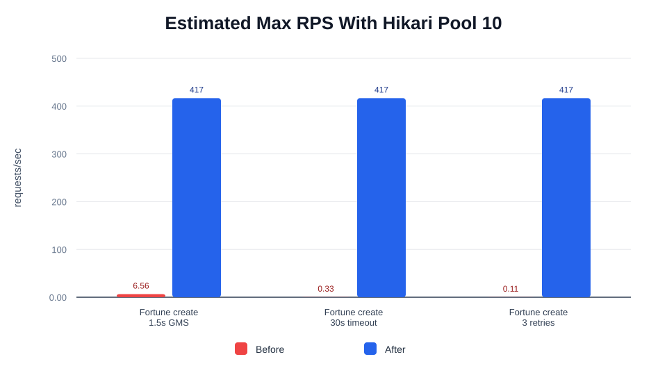

# 트러블 슈팅 1. 운세 생성 외부 I/O 트랜잭션 분리 Before / After

## 요약

운세 생성/재조회 API에서 GMS 호출, 카드 렌더링, MinIO 업로드가 Spring transaction 안에서 실행되던 구조를 분리했습니다.

이 작업의 핵심은 DB 쿼리 자체를 빠르게 만든 것이 아니라, 느린 외부 I/O 중 HikariCP 커넥션을 붙잡지 않도록 트랜잭션 경계를 줄인 것입니다.

문의 답변 SMTP 최적화도 같은 기술을 사용했지만, 장애 원인과 API 흐름이 다르기 때문에 별도 트러블 슈팅 2로 분리했습니다.

| 사용 기법 | 적용 위치 | 기대 효과 |
| --- | --- | --- |
| 트랜잭션 경계 축소 | 운세 생성, 운세 재조회 | GMS/MinIO 대기 중 DB 커넥션 점유 제거 |
| 외부 API 격리 | GMS, MinIO | timeout/retry가 DB transaction duration으로 전파되지 않음 |
| 짧은 write transaction | 운세 저장 구간 | `artifact`, `fortune_artifact`, `gallery` 저장 원자성 유지 |
| 수치화 | synthetic capacity model | before/after connection hold time, pool capacity 비교 |
| 실제 경로 확인 | k6 | 운세 생성 HTTP 경로의 p95, p99, RPS, 실패율 확인 |

<br>

## 자료 위치

| 구분 | 경로 |
| --- | --- |
| 최적화 문서 | `backend/docs/performance/01-운세-생성-외부-io-트랜잭션-분리/README.md` |
| 운세 생성 코드 | `backend/src/main/java/com/nemonicworld/fortune/service/fortune/FortuneCreateUseCase.java` |
| 운세 재조회 코드 | `backend/src/main/java/com/nemonicworld/fortune/service/fortune/FortuneTodayQueryUseCase.java` |
| 짧은 트랜잭션 지원 코드 | `backend/src/main/java/com/nemonicworld/fortune/service/fortune/FortuneTransactionSupport.java` |
| synthetic benchmark | `backend/scripts/benchmark-transaction-io-performance.py` |
| k6 스크립트 | `backend/docs/performance/01-운세-생성-외부-io-트랜잭션-분리/k6/01-운세-생성-k6.js` |
| k6 결과 파일 | `backend/docs/performance/01-운세-생성-외부-io-트랜잭션-분리/k6/results/01-운세-생성-k6-결과.md` |
| k6 Web Dashboard HTML | `backend/docs/performance/01-운세-생성-외부-io-트랜잭션-분리/k6/results/01-fortune-create-dashboard.html` |
| k6 캡처 | `backend/docs/performance/01-운세-생성-외부-io-트랜잭션-분리/captures/` |
| 그래프 assets | `backend/docs/performance/01-운세-생성-외부-io-트랜잭션-분리/graphs/` |

## 산출물 검증

| 산출물 | 파일 | 확인 내용 |
| --- | --- | --- |
| k6 실행 파일 | `./k6/01-운세-생성-k6.js` | `fortune_create` endpoint tag, p95 threshold `10,000ms`, 상세 summary 출력 설정 |
| k6 결과 Markdown | `./k6/results/01-운세-생성-k6-결과.md` | 요청 수, RPS, p50/p95/p99, 실패율, 상세 터미널 지표 |
| k6 결과 JSON | `./k6/results/01-운세-생성-k6-결과.json` | 같은 실행의 원본 summary data |
| Web Dashboard HTML | `./k6/results/01-fortune-create-dashboard.html` | k6 내장 dashboard export 결과 |
| Dashboard 캡처 | `./captures/k6-dashboard-overview.png` | 상단 지표 카드와 HTTP Performance overview |
| Duration 캡처 | `./captures/k6-dashboard-duration.png` | avg/p90/p95/p99 latency 흐름 |
| 터미널 캡처 | `./captures/k6-terminal-summary.png` | `failed=0.00%`, `checks=100.00%`, 상세 k6 지표 |

## 사용한 k6

k6는 트랜잭션 커넥션 점유 before/after를 직접 측정하는 도구가 아니라, 리팩토링 후 실제 HTTP 경로가 실패 없이 처리되는지 확인하는 용도입니다.

| 측정 대상 | k6 스크립트 | endpoint tag | 결과 파일 |
| --- | --- | --- | --- |
| 운세 생성 | `backend/docs/performance/01-운세-생성-외부-io-트랜잭션-분리/k6/01-운세-생성-k6.js` | `fortune_create` | `backend/docs/performance/01-운세-생성-외부-io-트랜잭션-분리/k6/results/01-운세-생성-k6-결과.md` |

### k6 실행 조건

| 측정 대상 | VU | Duration | Ramp up | Ramp down | 외부 I/O 조건 |
| --- | ---: | --- | --- | --- | --- |
| 운세 생성 | 3 | 20s | 5s | 5s | GMS 로컬 stub, MinIO 로컬 |

스크립트 기본 p95 threshold는 `10,000ms`입니다. 이 threshold는 “운세 생성 API가 실패 없이 완료되는지”를 확인하기 위한 안전선이고, 커넥션 점유 before/after 개선폭은 아래 synthetic capacity model로 판단합니다.

### k6 결과

| 측정 대상 | 요청 수 | RPS | p50 | p95 | p99 | 실패율 |
| --- | ---: | ---: | ---: | ---: | ---: | ---: |
| 운세 생성 | 14 | 0.43 | 4,535.45ms | 5,740.94ms | 5,986.76ms | 0.00% |

현재 로컬 운세 생성 k6는 GMS와 카드 생성 경로까지 타기 때문에 HTTP latency 자체는 큽니다. 이 문서의 before/after 핵심 수치는 아래 HikariCP 커넥션 점유 모델입니다.

### k6 실측 캡처







```bash
k6 run \
  -e BASE_URL=http://localhost:8080/api/v1 \
  -e RAMP_UP=5s \
  -e DURATION=20s \
  -e RAMP_DOWN=5s \
  -e VUS=3 \
  -e P95_THRESHOLD_MS=10000 \
  backend/docs/performance/01-운세-생성-외부-io-트랜잭션-분리/k6/01-운세-생성-k6.js
```

<br>

## 최적화 대상

### Before

기존 구조에서는 서비스 메서드 전체가 하나의 트랜잭션으로 묶여 있었습니다.

```text
DB 조회
-> GMS 호출
-> 카드 렌더링
-> MinIO 업로드
-> artifact / fortune_artifact / gallery 저장
-> transaction commit
```

이 구조에서는 첫 DB 접근 이후 GMS와 MinIO I/O가 끝날 때까지 커넥션이 반환되지 않을 수 있습니다. GMS 기본 read timeout은 `30,000ms`이고 운세 생성은 최대 `3회` 시도하므로, 장애 상황에서는 DB 작업이 거의 없어도 트랜잭션이 오래 유지될 수 있습니다.

### After

변경 후에는 외부 I/O를 트랜잭션 밖에서 실행하고, DB 조회/저장만 짧은 트랜잭션으로 묶습니다.

```text
짧은 read transaction
-> GMS 호출
-> 카드 렌더링
-> MinIO 업로드
-> 짧은 write transaction
```

관련 코드:

- `FortuneCreateUseCase.createFortune(...)`
- `FortuneTodayQueryUseCase.getTodayFortune(...)`
- `FortuneTransactionSupport`

<br>

## Before / After 수치

측정은 운영 트래픽 실측이 아니라, 현재 코드의 트랜잭션 경계와 외부 latency 시나리오를 반영한 synthetic capacity model입니다. 절대값보다 “GMS/MinIO 대기 시간이 커넥션 점유 시간에 포함되는가”를 비교하기 위한 모델입니다.

```bash
python3 backend/scripts/benchmark-transaction-io-performance.py \
  --scenario-group fortune \
  --output-dir backend/docs/performance/01-운세-생성-외부-io-트랜잭션-분리/graphs
```

가정:

- Hikari pool size: `10`
- 운세 생성 DB 구간: `24ms`
- GMS read timeout: `30,000ms`
- 운세 생성 최대 시도 횟수: `3회`

| 시나리오 | Before 커넥션 점유 | After 커넥션 점유 | 감소율 | Before 100건 커넥션-초 | After 100건 커넥션-초 | Before pool 10 RPS | After pool 10 RPS | 처리 여유 |
| --- | ---: | ---: | ---: | ---: | ---: | ---: | ---: | ---: |
| 운세 생성 - GMS 1.5초 성공 | 1,524.00ms | 24.00ms | 98.43% | 152.40s | 2.40s | 6.56 | 416.67 | 63.50x |
| 운세 생성 - GMS 30초 timeout | 30,024.00ms | 24.00ms | 99.92% | 3,002.40s | 2.40s | 0.33 | 416.67 | 1,251.00x |
| 운세 생성 - GMS 3회 timeout | 90,024.00ms | 24.00ms | 99.97% | 9,002.40s | 2.40s | 0.11 | 416.67 | 3,751.00x |

### 한국어 그래프





### English Graphs





<br>

## 코드 변경 내용

### 운세 생성

`FortuneCreateUseCase.createFortune(...)`에서 메서드 전체 `@Transactional`을 제거했습니다. 중복 생성 여부 확인은 짧은 read transaction으로 수행하고, GMS 호출과 카드 렌더링/업로드는 트랜잭션 밖에서 실행합니다.

`artifact`, `fortune_artifact`, `gallery` 저장은 `FortuneTransactionSupport.saveFortune(...)`에서 짧은 write transaction으로 묶어 기존 원자성을 유지했습니다.

### 운세 재조회

`FortuneTodayQueryUseCase.getTodayFortune(...)`에서 메서드 전체 `@Transactional`을 제거했습니다. 저장된 운세 조회는 read transaction으로 끝내고, 오래된 카드 이미지 재생성/MinIO 업로드는 트랜잭션 밖에서 수행합니다.

이미지 object key 갱신만 짧은 write transaction으로 처리합니다.

<br>

## 운영 검증 지표

| 지표 | 볼 것 |
| --- | --- |
| `hikaricp_connections_active` | 운세 생성 트래픽 중 active connection이 pool size에 붙는지 |
| `hikaricp_connections_pending` | GMS 지연 중 커넥션 대기 요청이 생기는지 |
| `hikaricp_connections_timeout_total` | 커넥션 획득 timeout이 증가하는지 |
| `http_server_requests_seconds_bucket` | 운세 생성 p95/p99 latency가 외부 I/O 장애에 어떻게 반응하는지 |
| `fortune_gms_succeeded`, `fortune_gms_failed` 로그 | GMS latency와 retry가 커넥션 pool 압박으로 번지는지 |

<br>

## 검증

외부 호출 시점에 실제 Spring transaction이 열려 있지 않은지 확인하는 assertion을 통합 테스트에 추가했습니다.

```bash
cd backend
./gradlew --no-daemon test --tests com.nemonicworld.fortune.controller.FortuneControllerIntegrationTest
```

추가로 전체 backend 검증을 실행했습니다.

```bash
cd backend
./gradlew --no-daemon spotlessCheck test bootJar
```

결과: `BUILD SUCCESSFUL`
