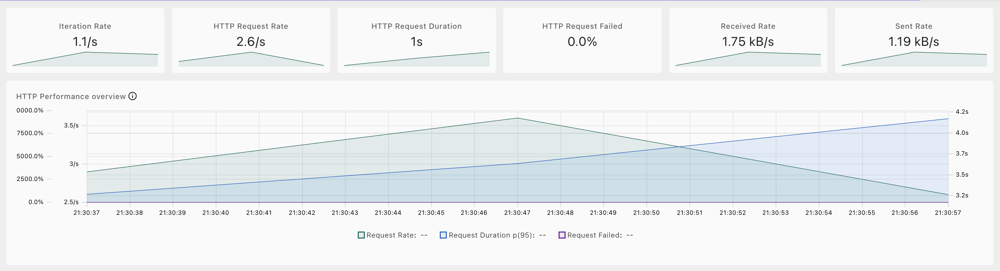
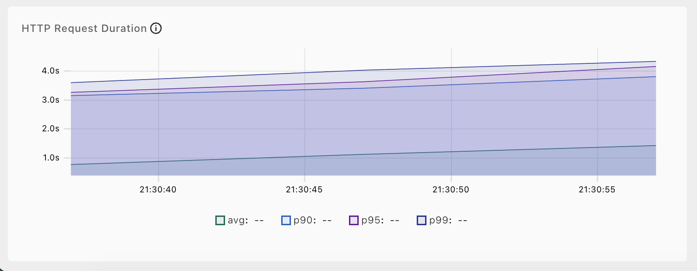
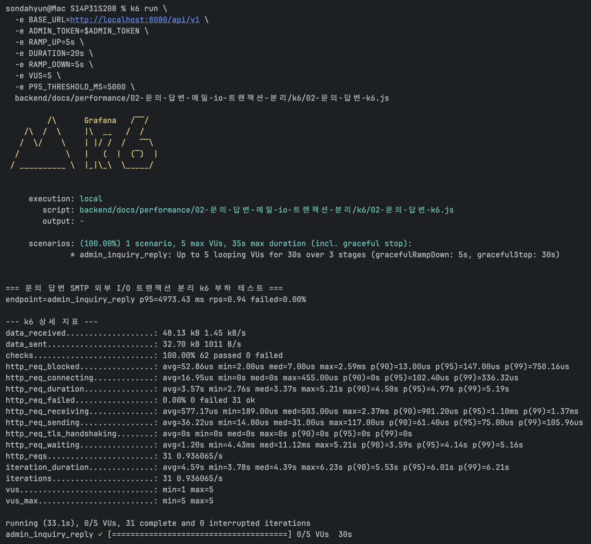
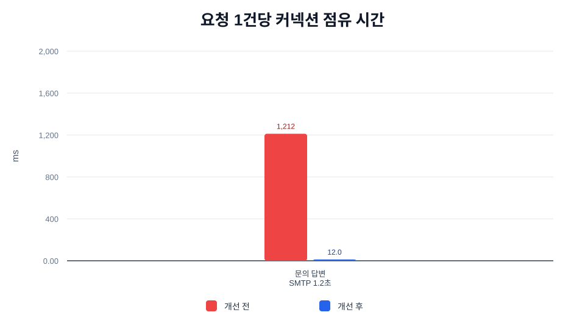
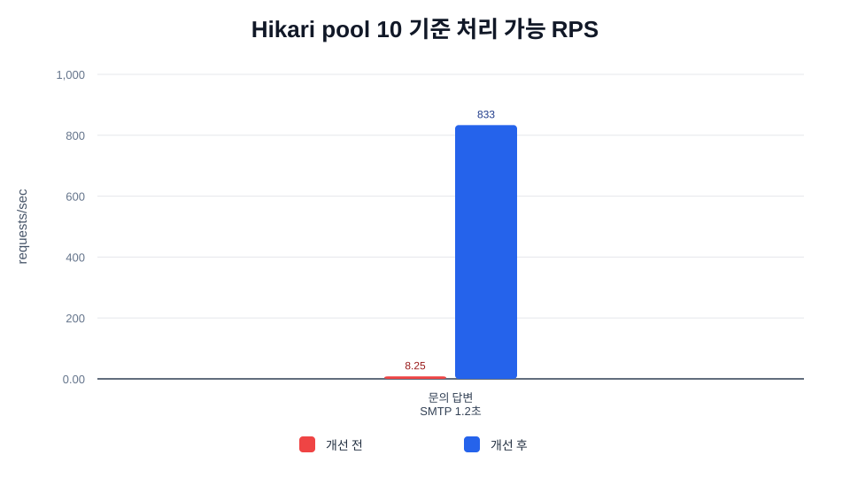
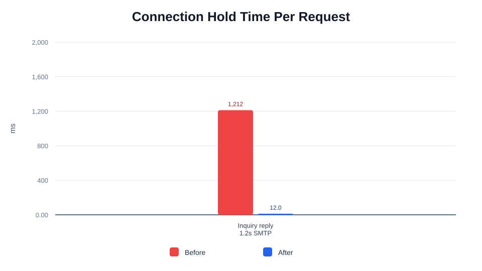
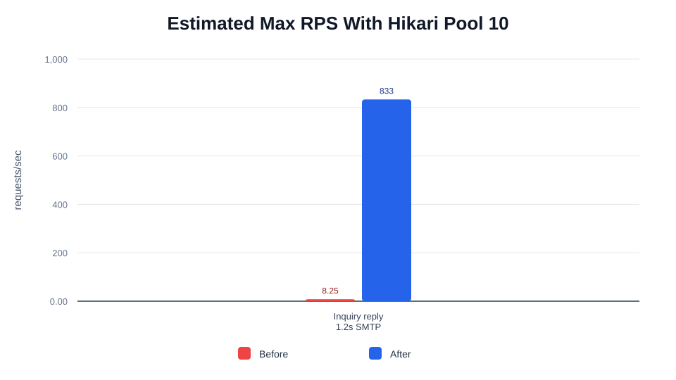

# 트러블 슈팅 2. 문의 답변 SMTP I/O 트랜잭션 분리 Before / After

## 요약

관리자 문의 답변 API에서 SMTP 메일 발송이 Spring transaction 안에서 실행되던 구조를 분리했습니다.

이 사건은 운세 생성과 같은 “외부 I/O 트랜잭션 분리” 계열이지만, 대상 API와 외부 시스템이 다릅니다. 운세 생성은 GMS/MinIO가 병목이고, 문의 답변은 SMTP 발송 대기가 병목이므로 별도 트러블 슈팅으로 정리했습니다.

| 사용 기법 | 적용 위치 | 기대 효과 |
| --- | --- | --- |
| 트랜잭션 경계 축소 | 문의 답변 API | SMTP 대기 중 DB 커넥션 점유 제거 |
| 외부 I/O 격리 | SMTP 메일 발송 | 메일 서버 지연이 DB transaction duration으로 전파되지 않음 |
| 짧은 DB 갱신 | 문의 답변 상태 update | 답변 상태 변경 구간만 DB 작업으로 제한 |
| 수치화 | synthetic capacity model | before/after connection hold time, pool capacity 비교 |
| 실제 경로 확인 | k6 | 관리자 문의 답변 HTTP 경로의 p95, p99, RPS, 실패율 확인 |

<br>

## 자료 위치

| 구분 | 경로 |
| --- | --- |
| 최적화 문서 | `backend/docs/performance/02-문의-답변-메일-io-트랜잭션-분리/README.md` |
| 문의 답변 코드 | `backend/src/main/java/com/nemonicworld/inquiry/service/admin/AdminInquiryCommandUseCase.java` |
| synthetic benchmark | `backend/scripts/benchmark-transaction-io-performance.py` |
| k6 스크립트 | `backend/docs/performance/02-문의-답변-메일-io-트랜잭션-분리/k6/02-문의-답변-k6.js` |
| k6 결과 파일 | `backend/docs/performance/02-문의-답변-메일-io-트랜잭션-분리/k6/results/02-문의-답변-k6-결과.md` |
| k6 Web Dashboard HTML | `backend/docs/performance/02-문의-답변-메일-io-트랜잭션-분리/k6/results/02-admin-inquiry-reply-dashboard.html` |
| k6 캡처 | `backend/docs/performance/02-문의-답변-메일-io-트랜잭션-분리/captures/` |
| 그래프 assets | `backend/docs/performance/02-문의-답변-메일-io-트랜잭션-분리/graphs/` |

## 산출물 검증

| 산출물 | 파일 | 확인 내용 |
| --- | --- | --- |
| k6 실행 파일 | `./k6/02-문의-답변-k6.js` | `admin_inquiry_reply` endpoint tag, `ADMIN_TOKEN` 필수, p95 threshold `5,000ms` |
| k6 결과 Markdown | `./k6/results/02-문의-답변-k6-결과.md` | 요청 수, RPS, p50/p95/p99, 실패율, 상세 터미널 지표 |
| k6 결과 JSON | `./k6/results/02-문의-답변-k6-결과.json` | 같은 실행의 원본 summary data |
| Web Dashboard HTML | `./k6/results/02-admin-inquiry-reply-dashboard.html` | k6 내장 dashboard export 결과 |
| Dashboard 캡처 | `./captures/k6-dashboard-overview.png` | 상단 지표 카드와 HTTP Performance overview |
| Duration 캡처 | `./captures/k6-dashboard-duration.png` | avg/p90/p95/p99 latency 흐름 |
| 터미널 캡처 | `./captures/k6-terminal-summary.png` | `failed=0.00%`, `checks=100.00%`, 상세 k6 지표 |

## 사용한 k6

k6는 리팩토링 후 실제 HTTP 경로가 로컬 통제 환경에서 실패 없이 처리되는지 확인하는 용도입니다.

| 측정 대상 | k6 스크립트 | endpoint tag | 결과 파일 |
| --- | --- | --- | --- |
| 문의 답변 | `backend/docs/performance/02-문의-답변-메일-io-트랜잭션-분리/k6/02-문의-답변-k6.js` | `admin_inquiry_reply` | `backend/docs/performance/02-문의-답변-메일-io-트랜잭션-분리/k6/results/02-문의-답변-k6-결과.md` |

### k6 실행 조건

| 측정 대상 | VU | Duration | Ramp up | Ramp down | 외부 I/O 조건 |
| --- | ---: | --- | --- | --- | --- |
| 문의 답변 | 5 | 20s | 5s | 5s | 로컬 테스트 SMTP 설정 |

스크립트 기본 p95 threshold는 `5,000ms`입니다. 로컬 SMTP stub이 아니라 실제 SMTP 설정으로 실행하면 메일 서버 응답 시간이 섞여 p95가 3초를 넘을 수 있으므로, k6 threshold는 “요청 성공 여부를 확인하는 안전선”으로 사용하고 커넥션 점유 before/after는 아래 synthetic capacity model로 판단합니다.

### k6 결과

| 측정 대상 | 요청 수 | RPS | p50 | p95 | p99 | 실패율 |
| --- | ---: | ---: | ---: | ---: | ---: | ---: |
| 문의 답변 | 31 | 0.94 | 3,371.68ms | 4,973.43ms | 5,193.54ms | 0.00% |

### k6 실측 캡처







```bash
k6 run \
  -e BASE_URL=http://localhost:8080/api/v1 \
  -e ADMIN_TOKEN=<관리자-access-token> \
  -e RAMP_UP=5s \
  -e DURATION=20s \
  -e RAMP_DOWN=5s \
  -e VUS=5 \
  -e P95_THRESHOLD_MS=5000 \
  backend/docs/performance/02-문의-답변-메일-io-트랜잭션-분리/k6/02-문의-답변-k6.js
```

<br>

## 최적화 대상

### Before

기존 구조에서는 문의 답변 메서드 전체가 하나의 트랜잭션으로 묶여 있었습니다.

```text
문의 조회
-> SMTP 메일 발송
-> 답변 상태 갱신
-> transaction commit
```

이 구조에서는 문의 조회로 커넥션을 확보한 뒤 SMTP 응답을 기다리는 동안 DB 커넥션을 오래 점유할 수 있습니다. 메일 서버 지연은 DB 작업이 아니지만, 트랜잭션 범위 안에 있으면 HikariCP active connection 증가로 이어질 수 있습니다.

### After

변경 후에는 SMTP 발송을 트랜잭션 밖에서 실행하고, 답변 상태 갱신만 짧은 DB 작업으로 처리합니다.

```text
짧은 read transaction
-> SMTP 메일 발송
-> 짧은 update
```

관련 코드:

- `AdminInquiryCommandUseCase.replyInquiry(...)`

<br>

## Before / After 수치

측정은 운영 트래픽 실측이 아니라, 현재 코드의 트랜잭션 경계와 SMTP latency 시나리오를 반영한 synthetic capacity model입니다. 절대값보다 “SMTP 대기 시간이 커넥션 점유 시간에 포함되는가”를 비교하기 위한 모델입니다.

```bash
python3 backend/scripts/benchmark-transaction-io-performance.py \
  --scenario-group inquiry \
  --output-dir backend/docs/performance/02-문의-답변-메일-io-트랜잭션-분리/graphs
```

가정:

- Hikari pool size: `10`
- 문의 답변 DB 구간: `12ms`
- SMTP 응답 시간: `1,200ms`

| 시나리오 | Before 커넥션 점유 | After 커넥션 점유 | 감소율 | Before 100건 커넥션-초 | After 100건 커넥션-초 | Before pool 10 RPS | After pool 10 RPS | 처리 여유 |
| --- | ---: | ---: | ---: | ---: | ---: | ---: | ---: | ---: |
| 문의 답변 - SMTP 1.2초 | 1,212.00ms | 12.00ms | 99.01% | 121.20s | 1.20s | 8.25 | 833.33 | 101.00x |

### 한국어 그래프





### English Graphs





<br>

## 코드 변경 내용

`AdminInquiryCommandUseCase.replyInquiry(...)`에서 메서드 전체 `@Transactional`을 제거했습니다.

문의 조회 후 SMTP 메일 발송을 트랜잭션 밖에서 실행하고, 답변 상태 갱신은 짧은 JDBC update로 처리합니다. 기존에도 메일 발송 후 DB 상태를 갱신하는 순서였으므로 사용자 관점의 동작 순서는 유지됩니다.

<br>

## 운영 검증 지표

| 지표 | 볼 것 |
| --- | --- |
| `hikaricp_connections_active` | 문의 답변 트래픽 중 active connection이 pool size에 붙는지 |
| `hikaricp_connections_pending` | SMTP 지연 중 커넥션 대기 요청이 생기는지 |
| `hikaricp_connections_timeout_total` | 커넥션 획득 timeout이 증가하는지 |
| `http_server_requests_seconds_bucket` | 문의 답변 p95/p99 latency가 SMTP 지연에 어떻게 반응하는지 |

<br>

## 검증

SMTP 발송 시점에 실제 Spring transaction이 열려 있지 않은지 확인하는 assertion을 통합 테스트에 추가했습니다.

```bash
cd backend
./gradlew --no-daemon test --tests com.nemonicworld.inquiry.controller.AdminInquiryControllerIntegrationTest
```

추가로 전체 backend 검증을 실행했습니다.

```bash
cd backend
./gradlew --no-daemon spotlessCheck test bootJar
```

결과: `BUILD SUCCESSFUL`
