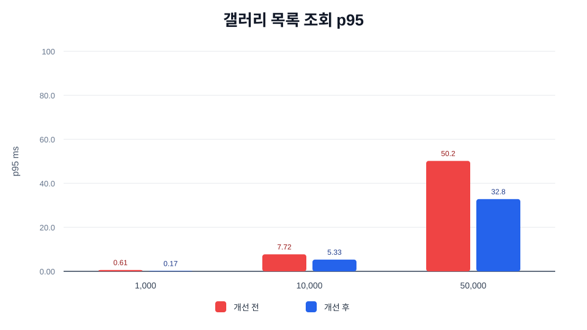
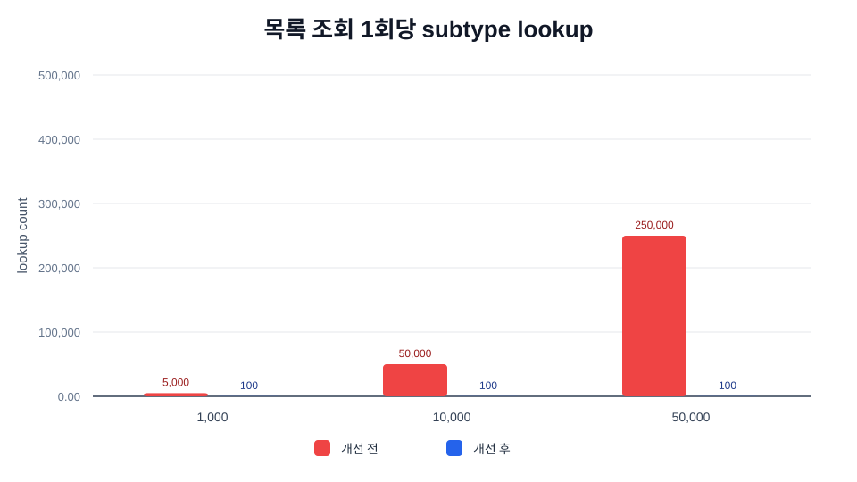
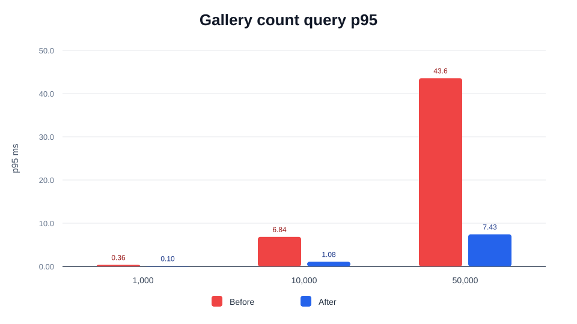

# 트러블 슈팅 3. 갤러리 목록 조회 쿼리 최적화 Before / After

## 요약

내 갤러리 목록 조회 API는 사용자의 보관 결과물을 최신순으로 조회하고, 응답에 `totalElements`와 `hasNext`를 함께 내려줍니다.

기존 구현은 `COUNT(*)`와 목록 조회 모두에서 `fortune_artifact`, `relay_drawing_artifact`, `flipbook_artifact`, `infinite_canvas_artifact`, `phone_artifact`를 함께 `LEFT JOIN`했습니다. 하지만 count는 subtype URL이 필요 없고, 목록 조회도 실제 응답 page에 포함되는 20~50개 항목에 대해서만 subtype URL이 필요합니다.

이번 최적화는 API 응답 contract를 유지하면서 불필요한 subtype JOIN 범위를 줄인 작업입니다.

| 사용 기법 | 적용 위치 | 기대 효과 |
| --- | --- | --- |
| 쿼리 shape 축소 | 갤러리 count | `COUNT(*)`에서 불필요한 subtype `LEFT JOIN` 제거 |
| 페이지 선별 후 JOIN | 갤러리 목록 | page 대상 artifact를 먼저 고른 뒤 해당 page만 subtype JOIN |
| 페이지네이션 최적화 | `GET /api/v1/gallery` | page size와 무관하게 전체 row에 subtype JOIN하던 비용 제거 |
| Latency 측정 | synthetic benchmark | count/list p95 before/after 비교 |
| Throughput 개선 기반 | DB 부하 감소 | 같은 DB 리소스로 처리 가능한 목록 조회 수 증가 |

<br>

## 자료 위치

| 구분 | 경로 |
| --- | --- |
| 최적화 문서 | `backend/docs/performance/03-갤러리-목록-조회-쿼리-최적화/README.md` |
| 갤러리 조회 코드 | `backend/src/main/java/com/nemonicworld/gallery/service/gallery/GalleryQueryUseCase.java` |
| 갤러리 SQL 코드 | `backend/src/main/java/com/nemonicworld/gallery/repository/GalleryRepository.java` |
| synthetic benchmark | `backend/scripts/benchmark-gallery-query-performance.py` |
| k6 스크립트 | `backend/docs/performance/03-갤러리-목록-조회-쿼리-최적화/k6/03-갤러리-목록-조회-k6.js` |
| k6 결과 파일 | `backend/docs/performance/03-갤러리-목록-조회-쿼리-최적화/k6/results/03-갤러리-목록-조회-k6-결과.md` |
| 그래프 assets | `backend/docs/performance/03-갤러리-목록-조회-쿼리-최적화/graphs/gallery-query-count-p95-ko.svg`, `backend/docs/performance/03-갤러리-목록-조회-쿼리-최적화/graphs/gallery-query-list-p95-ko.svg`, `backend/docs/performance/03-갤러리-목록-조회-쿼리-최적화/graphs/gallery-query-subtype-lookup-ko.svg` |

## 사용한 k6

갤러리 쿼리 최적화는 synthetic benchmark로 SQL shape 차이를 수치화하고, k6로 실제 `GET /api/v1/gallery` HTTP 경로의 p95, RPS, 실패율을 확인했습니다.

| 측정 대상 | k6 스크립트 | endpoint tag | 결과 파일 |
| --- | --- | --- | --- |
| 갤러리 목록 조회 | `backend/docs/performance/03-갤러리-목록-조회-쿼리-최적화/k6/03-갤러리-목록-조회-k6.js` | `gallery_list` | `backend/docs/performance/03-갤러리-목록-조회-쿼리-최적화/k6/results/03-갤러리-목록-조회-k6-결과.md` |

### k6 실행 조건

| 항목 | 값 |
| --- | --- |
| 대상 API | `GET /api/v1/gallery?page=0&size=20` |
| Seed | 단일 사용자 active gallery row 10,000개 |
| VU | 20 |
| Duration | 30s |
| Ramp up / down | 5s / 5s |

### k6 결과

| 요청 수 | RPS | p50 | p95 | p99 | 실패율 |
| ---: | ---: | ---: | ---: | ---: | ---: |
| 701 | 17.20 | 11.22ms | 16.10ms | 22.94ms | 0.00% |

이 k6 결과는 쿼리 shape 최적화 이후 실제 HTTP 목록 조회 경로가 VU 20 조건에서 p95 20ms 전후로 안정적으로 처리된다는 것을 확인한 값입니다. SQL 구조 자체의 before/after 비교는 아래 synthetic benchmark 표와 그래프를 기준으로 봅니다.

실행 예시:

```bash
k6 run \
  -e BASE_URL=http://localhost:8080/api/v1 \
  -e USER_UUID=<익명-사용자-UUID> \
  -e RAMP_UP=5s \
  -e DURATION=30s \
  -e RAMP_DOWN=5s \
  -e VUS=20 \
  backend/docs/performance/03-갤러리-목록-조회-쿼리-최적화/k6/03-갤러리-목록-조회-k6.js
```

<br>

## 최적화 대상

관련 코드:

- `GalleryQueryUseCase.getMyGallery(...)`
- `GalleryRepository.findActiveItemsByUserId(...)`
- `GalleryRepository.countActiveItemsByUserId(...)`

응답 contract:

```json
{
  "items": [],
  "page": 0,
  "size": 20,
  "totalElements": 0,
  "hasNext": false
}
```

이번 MR에서는 `totalElements`와 `hasNext`를 유지합니다. 따라서 `COUNT(*)` 자체를 제거하지 않고, count에 필요한 최소 JOIN만 남겼습니다.

<br>

## Before

### Count

기존 count는 목록 조회에서 쓰는 base SQL 조각을 공유하면서 subtype 테이블까지 함께 JOIN했습니다.

```text
gallery
-> artifact
-> fortune_artifact
-> relay_drawing_artifact
-> flipbook_artifact
-> infinite_canvas_artifact
-> phone_artifact
-> COUNT(*)
```

하지만 count에 필요한 조건은 다음뿐입니다.

```text
gallery.user_id = currentUser
gallery.deleted_at IS NULL
artifact row exists
```

즉 subtype URL을 계산하기 위한 5개 `LEFT JOIN`은 count에는 필요하지 않습니다.

### 목록 조회

기존 목록 조회는 모든 active gallery row에 subtype JOIN을 건 뒤 정렬과 `LIMIT/OFFSET`을 적용했습니다.

```text
gallery + artifact + subtype tables 전체 JOIN
-> ORDER BY artifact.created_at DESC, artifact.id DESC
-> LIMIT/OFFSET
```

page size가 20이어도 사용자의 gallery row가 50,000개면, 응답에 필요 없는 row까지 subtype URL 후보를 조회하는 구조였습니다.

<br>

## After

### Count

count는 `gallery + artifact`만 사용합니다.

```text
gallery
-> artifact
-> COUNT(*)
```

orphan gallery row는 기존처럼 제외하기 위해 `artifact` JOIN은 유지했습니다. subtype JOIN만 제거했습니다.

### 목록 조회

목록 조회는 CTE로 page 대상 artifact를 먼저 고른 뒤, 그 page row에 대해서만 subtype JOIN을 수행합니다.

```text
WITH page_items AS (
  gallery + artifact
  -> user/deleted filter
  -> ORDER BY artifact.created_at DESC, artifact.id DESC
  -> LIMIT/OFFSET
)
page_items 20~50개
-> subtype tables LEFT JOIN
-> contentUrl 계산
```

이 구조에서는 subtype URL 계산 비용이 전체 gallery row 수가 아니라 page size에 비례합니다.

<br>

## Before / After 수치

측정은 운영 DB 실측이 아니라, 현재 SQL 구조의 비용 차이를 재현하기 위한 synthetic benchmark입니다. 절대값보다 “subtype JOIN을 전체 row에 적용하는가, page row에만 적용하는가”를 비교하기 위한 모델입니다.

```bash
python3 backend/scripts/benchmark-gallery-query-performance.py --iterations 20 --output-dir backend/docs/performance/03-갤러리-목록-조회-쿼리-최적화/graphs
```

측정 조건:

- page size: `20`
- subtype 테이블 수: `5`
- active gallery rows: `1,000`, `10,000`, `50,000`
- count/list p95 latency와 목록 조회 1회당 subtype lookup 수 비교

| active gallery rows | Before count p95 ms | After count p95 ms | count 개선 배율 | Before list p95 ms | After list p95 ms | list 개선 배율 | Before subtype lookup | After subtype lookup |
| ---: | ---: | ---: | ---: | ---: | ---: | ---: | ---: | ---: |
| 1,000 | 0.36 | 0.10 | 3.76x | 0.61 | 0.17 | 3.57x | 5,000 | 100 |
| 10,000 | 6.84 | 1.08 | 6.35x | 7.72 | 5.33 | 1.45x | 50,000 | 100 |
| 50,000 | 43.57 | 7.43 | 5.86x | 50.19 | 32.85 | 1.53x | 250,000 | 100 |

### 한국어 그래프






### English Graphs




<br>

## 결과 해석

count 쿼리는 subtype JOIN을 완전히 제거했기 때문에 row 수가 증가할수록 개선이 뚜렷합니다.

- `1,000 rows`: p95 `0.36ms -> 0.10ms`, 약 `3.76x` 개선
- `10,000 rows`: p95 `6.84ms -> 1.08ms`, 약 `6.35x` 개선
- `50,000 rows`: p95 `43.57ms -> 7.43ms`, 약 `5.86x` 개선

목록 조회는 정렬과 `LIMIT/OFFSET` 비용이 여전히 남아 있기 때문에 count보다 개선 배율은 작습니다. 하지만 subtype lookup 대상은 전체 row 기준에서 page size 기준으로 줄었습니다.

- `50,000 rows` 기준 subtype lookup: `250,000 -> 100`
- `50,000 rows` 기준 목록 조회 p95: `50.19ms -> 32.85ms`, 약 `1.53x` 개선

즉 이번 최적화는 페이지네이션 API contract를 유지하면서, `totalElements` 계산과 content URL 계산에 들어가는 불필요한 JOIN 비용을 줄인 작업입니다.

<br>

## 남은 개선 여지

이번 MR은 기존 contract를 유지하므로 `totalElements`를 계속 계산합니다. 더 큰 개선을 원하면 API contract를 `Slice` 방식으로 바꾸는 선택지가 있습니다.

```text
현재: items + page + size + totalElements + hasNext
Slice 방식: items + page + size + hasNext
```

Slice 방식은 `size + 1`개를 조회해 `hasNext`만 판단하므로 `COUNT(*)`를 제거할 수 있습니다. 다만 프론트엔드가 전체 개수 표시를 사용하고 있다면 contract 조율이 필요합니다.

<br>

## 검증

갤러리 통합 테스트로 목록 정렬, totalElements, hasNext, subtype URL fallback, orphan row 제외 동작을 확인했습니다.

```bash
cd backend
./gradlew --no-daemon test --tests com.nemonicworld.gallery.controller.GalleryControllerIntegrationTest
```

추가로 전체 backend 검증을 실행했습니다.

```bash
cd backend
./gradlew --no-daemon spotlessCheck test bootJar
```

결과: `BUILD SUCCESSFUL`
