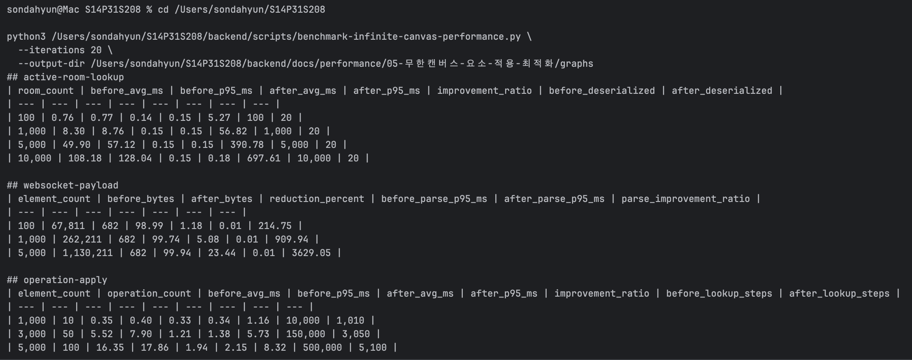
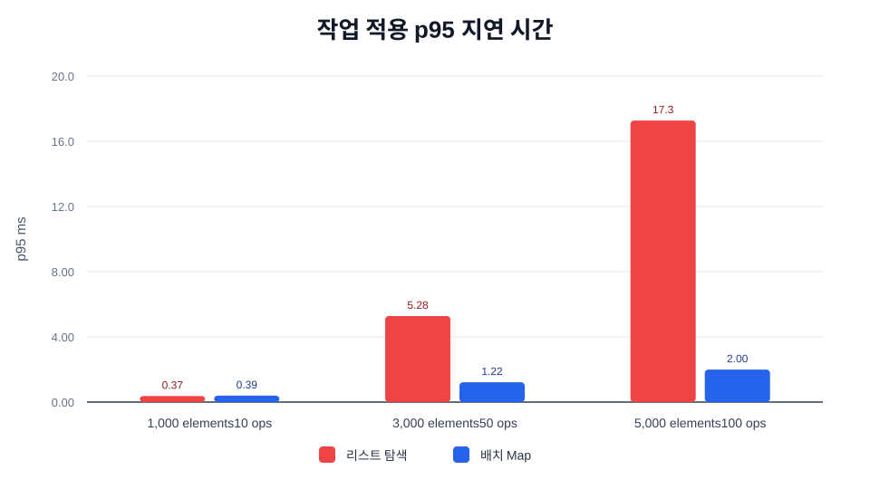
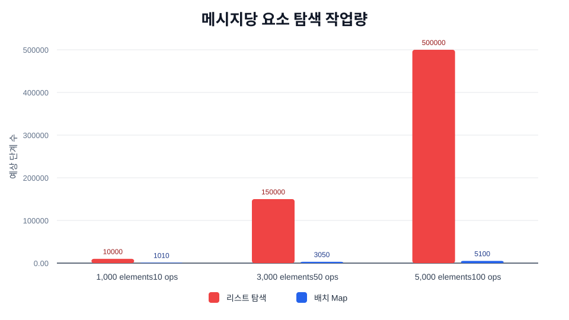
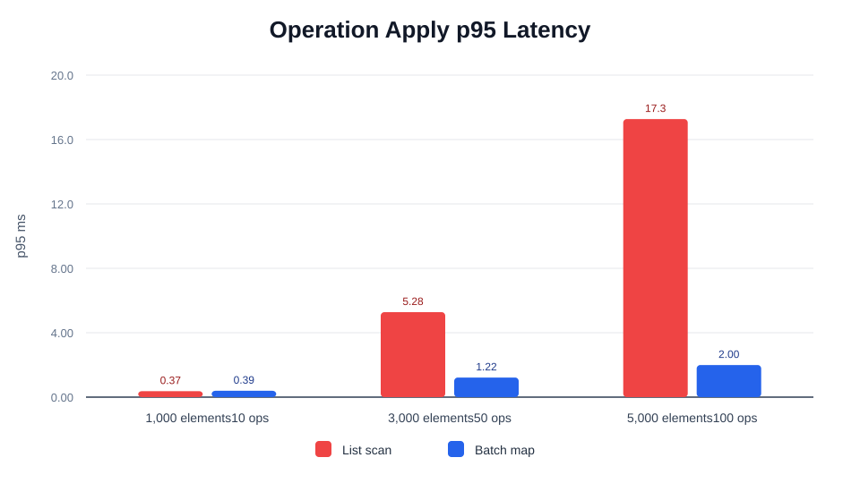
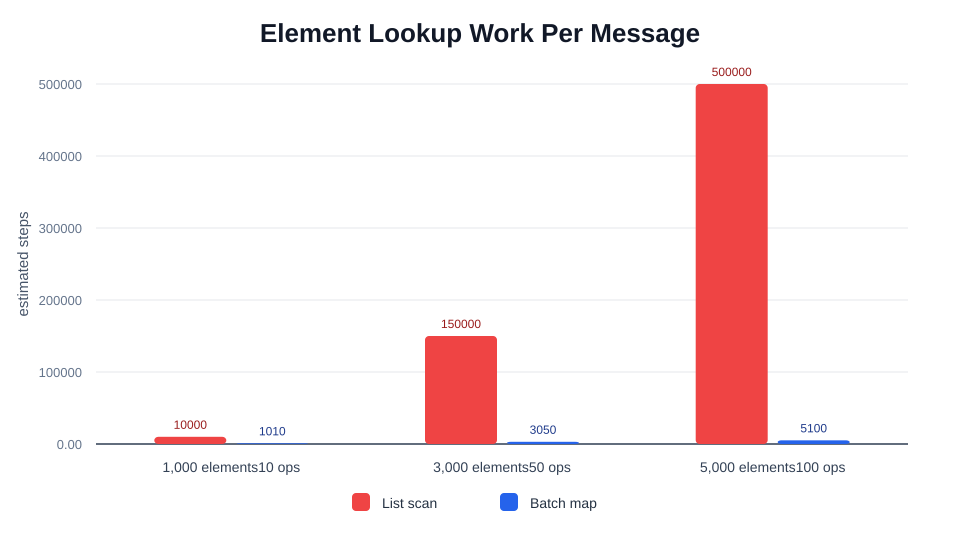

# 트러블 슈팅 5. 무한 캔버스 요소 적용 로직 최적화 Before / After

## 요약

이번 문서는 기존 무한 캔버스 성능 최적화 문서와 별도의 2차 최적화를 다룹니다.

- 기존 최적화: 활성 방 목록 조회와 WebSocket 참여자 이벤트 payload 최적화
- 이번 최적화: `applyOperations()` 내부의 요소 적용 로직 최적화

기존 그래프는 Redis 활성 방 조회와 WebSocket payload 크기를 설명합니다. 이번 그래프는 사용자가 도형을 추가, 수정, 삭제할 때 서버가 `elements` 목록에 operation을 반영하는 시간을 설명합니다. 따라서 기존 before/after 그래프와 섞지 않고 별도의 before/after로 관리합니다.

<br>

## 자료 위치

| 구분 | 경로 |
| --- | --- |
| 최적화 문서 | `backend/docs/performance/05-무한캔버스-요소-적용-최적화/README.md` |
| 편집 use case | `backend/src/main/java/com/nemonicworld/infinitecanvas/service/canvas/InfiniteCanvasEditingUseCase.java` |
| operation 적용 코드 | `backend/src/main/java/com/nemonicworld/infinitecanvas/service/canvas/InfiniteCanvasOperationApplier.java` |
| synthetic benchmark | `backend/scripts/benchmark-infinite-canvas-performance.py` |
| 관련 k6 가이드 | `backend/docs/performance/k6-실행-가이드.md` |
| benchmark 캡처 | `backend/docs/performance/05-무한캔버스-요소-적용-최적화/captures/benchmark-terminal-summary.png` |
| 그래프 assets | `backend/docs/performance/05-무한캔버스-요소-적용-최적화/graphs/infinite-canvas-operation-apply-p95-ko.svg`, `backend/docs/performance/05-무한캔버스-요소-적용-최적화/graphs/infinite-canvas-operation-lookup-steps-ko.svg` |

## 산출물 검증

| 산출물 | 파일 | 확인 내용 |
| --- | --- | --- |
| benchmark 스크립트 | `backend/scripts/benchmark-infinite-canvas-performance.py` | `operation-apply` 시나리오로 순수 요소 적용 로직 측정 |
| benchmark 캡처 | `./captures/benchmark-terminal-summary.png` | `operation-apply` 결과의 before/after p95와 improvement ratio |
| 한국어 그래프 | `./graphs/infinite-canvas-operation-apply-p95-ko.svg`, `./graphs/infinite-canvas-operation-lookup-steps-ko.svg` | README 표와 같은 operation apply 결과 시각화 |
| English Graphs | `./graphs/infinite-canvas-operation-apply-p95.svg`, `./graphs/infinite-canvas-operation-lookup-steps.svg` | 같은 결과의 영문 그래프 |
| k6 README | `./k6/README.md` | 직접 k6를 제외한 이유와 향후 WebSocket k6 방향 |

## 사용한 k6

이 트러블 슈팅의 핵심 대상은 HTTP 조회 API가 아니라 WebSocket 메시지 처리 중 실행되는 `applyOperations()` 내부 로직입니다. 그래서 현재 문서의 before/after 수치는 k6가 아니라 synthetic benchmark로 측정했습니다.

| 측정 대상 | 사용 도구 | 이유 |
| --- | --- | --- |
| operation apply p95 | `backend/scripts/benchmark-infinite-canvas-performance.py` | Redis, 네트워크, WebSocket broadcast를 제외하고 순수 적용 로직만 비교하기 위해 사용 |
| 실제 HTTP k6 | 해당 없음 | 현재 k6 스크립트는 HTTP API 중심이며, 이 로직을 직접 타격하는 WebSocket k6 스크립트는 아직 없음 |
| 관련 무한캔버스 k6 | `backend/docs/performance/04-무한캔버스-조회-payload-최적화/k6/04-무한캔버스-활성-방-목록-k6.js` | 트러블 슈팅 4의 활성 방 조회 API 검증용 |

향후 이 최적화를 k6로 직접 검증하려면 STOMP/WebSocket 연결, 방 입장, operation 전송, broadcast 수신까지 포함하는 별도 k6 WebSocket 시나리오를 추가해야 합니다.

### k6 포함 여부

| 항목 | 정리 |
| --- | --- |
| 현재 문서에 포함한 k6 | 직접 실행한 k6 없음 |
| 제외한 이유 | k6 HTTP 스크립트로는 WebSocket 내부 `applyOperations()` 순수 로직만 분리 측정하기 어렵기 때문 |
| 대신 사용한 측정 | `backend/scripts/benchmark-infinite-canvas-performance.py` |
| 참고 가능한 관련 k6 | `backend/docs/performance/04-무한캔버스-조회-payload-최적화/k6/04-무한캔버스-활성-방-목록-k6.js` |

### 현재 측정 결과

| 요소 수 | operation 수 | Before p95 | After p95 | 개선 |
| ---: | ---: | ---: | ---: | ---: |
| 1,000 | 10 | 0.40ms | 0.34ms | 1.16x |
| 3,000 | 50 | 7.90ms | 1.38ms | 5.73x |
| 5,000 | 100 | 17.86ms | 2.15ms | 8.32x |

이 트러블 슈팅까지 억지로 HTTP k6 수치로 묶으면 병목 원인을 잘못 설명할 수 있습니다. 그래서 개별 파일 안에 k6 제외 사유와 대체 측정 방식을 명확히 남겼습니다.

<br>

## 최적화 대상

무한 캔버스 편집 흐름은 다음 순서로 동작합니다.

```text
클라이언트가 operation 전송
-> 서버가 현재 room state 조회
-> 서버가 operation을 elements에 반영
-> Redis에 최신 state 저장
-> 다른 참여자에게 변경 이벤트 전파
```

이번 최적화는 이 중 `operation을 elements에 반영`하는 단계만 대상으로 합니다.

관련 코드:

- `InfiniteCanvasEditingUseCase.applyOperations(...)`
- `InfiniteCanvasOperationApplier.applyOperation(...)`
- `InfiniteCanvasOperationApplier.CanvasElementBatch`

<br>

## Before: 리스트 기반 요소 갱신

기존 구현은 operation 하나를 적용할 때마다 전체 요소 리스트를 다시 훑었습니다.

```text
UPSERT / UPDATE
-> elements.removeIf(elementId matches)
-> elements.add(updatedElement)

DELETE
-> elements.removeIf(elementId matches)
```

이 방식은 구현은 단순하지만, 요소 수와 operation 수가 함께 커질 때 비용이 빠르게 증가합니다.

```text
예상 탐색 비용 ~= elementCount * operationCount
```

예를 들어 `5000 elements + 100 operations`에서는 한 메시지를 처리하는 동안 최대 약 `500,000`번 수준의 요소 비교가 발생할 수 있습니다.

<br>

## After: Map 기반 batch 요소 갱신

변경 후에는 현재 요소 목록을 한 번 순회해 slot index를 만들고, operation들은 이 index를 기준으로 적용합니다.

```text
초기 elements 1회 순회
-> elementId -> slotKey 인덱스 구성
-> operation별 remove/upsert를 Map 기반으로 처리
-> 최종 elements list 재구성
```

예상 비용은 다음 구조로 바뀝니다.

```text
예상 탐색 비용 ~= elementCount + operationCount
```

동작 규칙은 기존과 동일하게 유지했습니다.

- `UPDATE` / `UPSERT`는 기존 같은 `elementId` 요소를 제거한 뒤 새 요소를 뒤에 추가합니다.
- `DELETE`는 같은 `elementId` 요소를 제거합니다.
- `CLEAR_CANVAS`는 요소와 lock을 모두 비웁니다.
- `id`가 없는 익명 요소는 기존 순서를 유지합니다.
- 중복 `elementId`가 이미 존재할 경우 기존 `removeIf`처럼 같은 `elementId`를 모두 제거합니다.

<br>

## 측정 방법

측정은 synthetic benchmark로 수행했습니다. Redis, 네트워크, WebSocket broadcast 비용을 제외하고 `elements`에 operation을 적용하는 순수 로직 비용만 비교합니다.

```bash
python3 backend/scripts/benchmark-infinite-canvas-performance.py --iterations 20 --output-dir backend/docs/performance/05-무한캔버스-요소-적용-최적화/graphs
```

측정 시나리오:

- `1000 elements + 10 operations`
- `3000 elements + 50 operations`
- `5000 elements + 100 operations`

측정 지표:

- 평균 처리 시간
- p95 처리 시간
- 예상 요소 탐색 작업량

<br>

## 측정 결과

| 요소 수 | operation 수 | Before avg ms | Before p95 ms | After avg ms | After p95 ms | p95 개선 배율 | Before 예상 탐색 | After 예상 탐색 |
| --- | ---: | ---: | ---: | ---: | ---: | ---: | ---: | ---: |
| 1,000 | 10 | 0.35 | 0.40 | 0.33 | 0.34 | 1.16x | 10,000 | 1,010 |
| 3,000 | 50 | 5.52 | 7.90 | 1.21 | 1.38 | 5.73x | 150,000 | 3,050 |
| 5,000 | 100 | 16.35 | 17.86 | 1.94 | 2.15 | 8.32x | 500,000 | 5,100 |

### benchmark 실측 캡처



### 한국어 그래프





### English Graphs





<br>

## 결과 해석

작은 캔버스에서는 Map index를 구성하는 고정 비용이 있어 개선폭이 작습니다. `1000 elements + 10 operations` 케이스에서는 p95가 `0.40ms -> 0.34ms`로 측정되어, 사용자가 체감할 정도의 차이는 아닙니다.

하지만 요소 수와 operation 수가 커질수록 결과가 뚜렷해집니다.

- `3000 elements + 50 operations`: p95 `7.90ms -> 1.38ms`, 약 `5.73x` 개선
- `5000 elements + 100 operations`: p95 `17.86ms -> 2.15ms`, 약 `8.32x` 개선

즉 이번 최적화는 작은 캔버스를 빠르게 만드는 목적보다는, 큰 캔버스에서 여러 변경이 한 번에 들어올 때 서버 처리 지연이 커지는 것을 막는 목적에 가깝습니다.

<br>

## 사용자 체감 영향

이 최적화가 직접 개선하는 것은 브라우저 FPS가 아니라 서버의 operation 적용 시간입니다.

체감상 기대할 수 있는 변화:

- 요소가 많은 캔버스에서 도형 이동/수정/삭제 반영 지연 감소
- 여러 operation이 한 메시지로 들어올 때 서버 처리 대기 감소
- 협업 중 변경 이벤트가 늦게 따라오는 현상 완화
- p95/p99 꼬리 지연 감소

다만 화면 렌더링 자체가 버벅이는 문제는 프론트엔드 렌더링, 캔버스 엔진, 네트워크, WebSocket 수신 처리도 함께 영향을 줍니다. 따라서 이번 최적화는 “화면 FPS 개선”이 아니라 “서버 반영 지연 감소”로 설명하는 것이 정확합니다.

<br>

## 기존 그래프와의 관계

기존 before/after 그래프에는 영향을 주지 않습니다.

| 문서 | Before | After | 설명 |
| --- | --- | --- | --- |
| 기존 Redis/WebSocket 최적화 | Redis SCAN, 전체 상태 payload | Sorted Set, delta payload | 조회와 이벤트 payload 최적화 |
| 이번 요소 적용 최적화 | 리스트 기반 요소 갱신 | Map 기반 batch 요소 갱신 | 편집 operation 적용 로직 최적화 |

따라서 발표나 포트폴리오에서는 두 최적화를 분리해서 설명하는 편이 좋습니다.

<br>

## 검증

로직 변경 후 무한 캔버스 통합 테스트를 실행했습니다.

```bash
cd backend
./gradlew --no-daemon test --tests com.nemonicworld.infinitecanvas.repository.RedisInfiniteCanvasRepositoryTest --tests com.nemonicworld.infinitecanvas.websocket.InfiniteCanvasEventPublisherTest --tests com.nemonicworld.backoffice.infinitecanvas.controller.BackofficeInfiniteCanvasControllerIntegrationTest --tests com.nemonicworld.infinitecanvas.controller.InfiniteCanvasControllerIntegrationTest
```

결과: `BUILD SUCCESSFUL`
