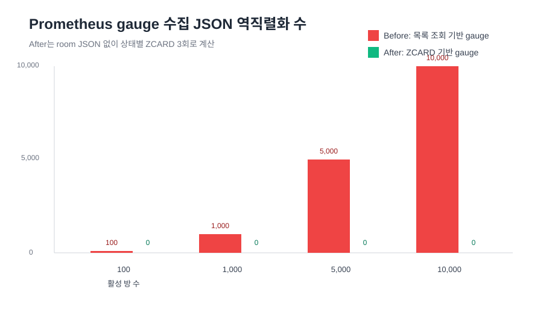
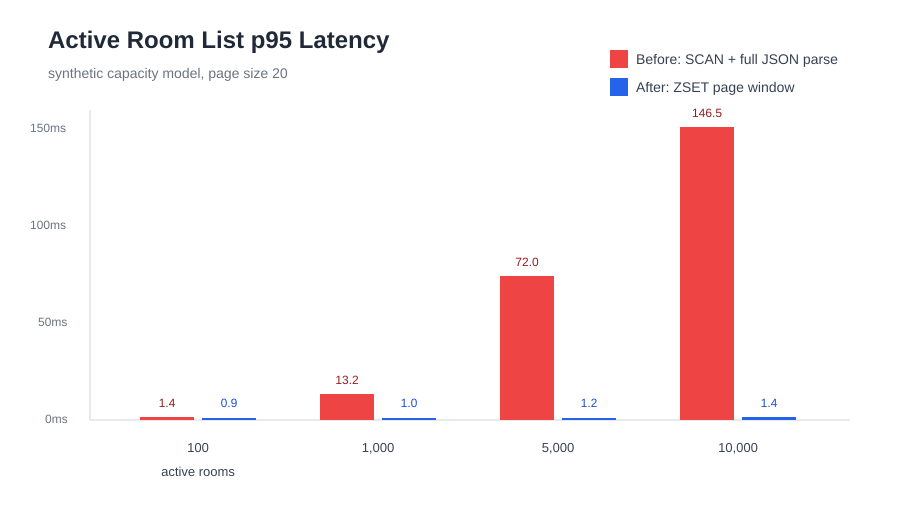
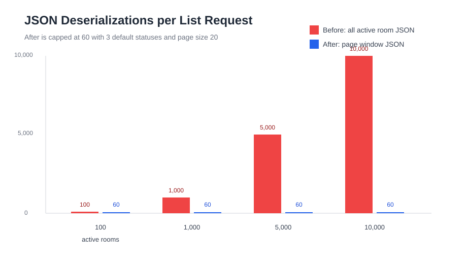
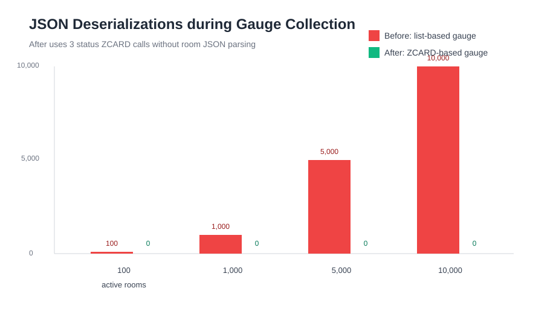
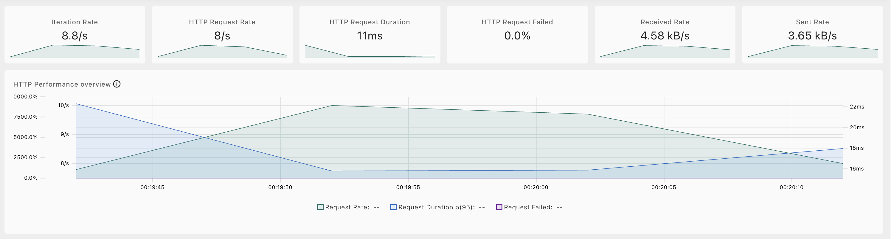
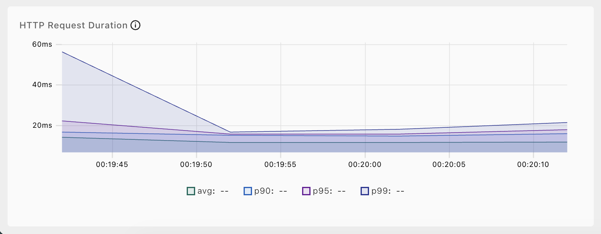
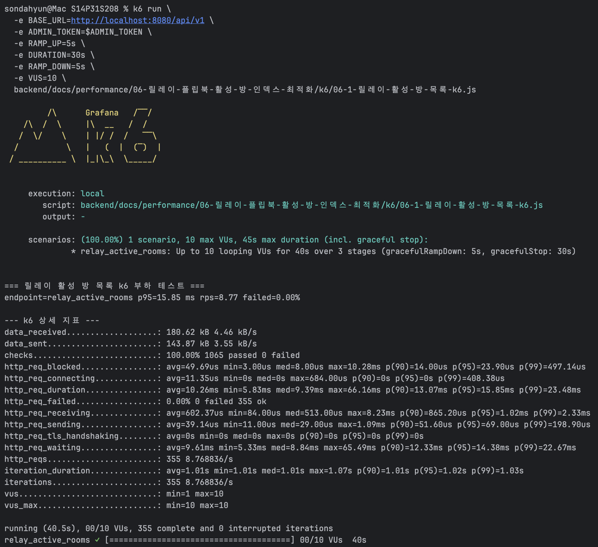

# 트러블 슈팅 6. 릴레이/플립북 활성 방 인덱스 최적화 Before / After

## 요약

백오피스 릴레이/플립북 활성 방 목록 조회와 Prometheus 활성 방 gauge 수집 경로가 Redis room key 전체를 `SCAN`하고 JSON을 역직렬화하던 구조를 개선했습니다.

이번 변경은 방 저장 시 상태별 Redis Sorted Set 인덱스를 함께 갱신하고, 백오피스 목록 조회는 필요한 상태와 페이지 범위만 인덱스로 읽도록 바꾼 작업입니다. 메트릭 수집은 room JSON 목록을 만들지 않고 상태별 `ZCARD` 합산만 수행합니다.

| 사용 기법 | 적용 위치 | 기대 효과 |
| --- | --- | --- |
| Redis Sorted Set 인덱스 | `relay:rooms:active:created-at:*`, `flipbook:rooms:active:created-at:*` | 전체 room key `SCAN` 제거 |
| 만료 정리 인덱스 | `relay:rooms:active:expires-at:*`, `flipbook:rooms:active:expires-at:*` | room JSON TTL 만료 후 gauge 과대계산 방지 |
| 상태별 인덱스 | `WAITING`, `PLAYING`, `FINALIZING`, `FINISHED` | status filter 요청에서 필요한 상태만 조회 |
| 페이지 window 조회 | 백오피스 목록 API | 전체 활성 방 JSON 역직렬화 대신 page window만 역직렬화 |
| Lazy backfill marker | 최초 조회 시 기존 Redis room state 보정 | 배포 전 생성된 room도 인덱스 누락 없이 조회 |
| ZSET count | `ContentActivityMetrics` | Prometheus scrape 때 JSON 역직렬화 없이 active room gauge 계산 |

<br>

## 자료 위치

| 구분 | 경로 |
| --- | --- |
| 최적화 문서 | `backend/docs/performance/06-릴레이-플립북-활성-방-인덱스-최적화/README.md` |
| 릴레이 repository | `backend/src/main/java/com/nemonicworld/relay/repository/RedisRelayRoomRepository.java` |
| 플립북 repository | `backend/src/main/java/com/nemonicworld/flipbook/repository/RedisFlipbookRoomRepository.java` |
| 릴레이 백오피스 조회 | `backend/src/main/java/com/nemonicworld/backoffice/relay/service/room/BackofficeRelayRoomQueryUseCase.java` |
| 플립북 백오피스 조회 | `backend/src/main/java/com/nemonicworld/backoffice/flipbook/service/room/BackofficeFlipbookRoomQueryUseCase.java` |
| 활성 방 메트릭 | `backend/src/main/java/com/nemonicworld/global/observability/ContentActivityMetrics.java` |
| k6 릴레이 | `backend/docs/performance/06-릴레이-플립북-활성-방-인덱스-최적화/k6/06-1-릴레이-활성-방-목록-k6.js` |
| k6 플립북 | `backend/docs/performance/06-릴레이-플립북-활성-방-인덱스-최적화/k6/06-2-플립북-활성-방-목록-k6.js` |
| 그래프 | `backend/docs/performance/06-릴레이-플립북-활성-방-인덱스-최적화/graphs/` |

## 산출물 검증

| 산출물 | 파일 | 확인 내용 |
| --- | --- | --- |
| k6 실행 파일 | `./k6/06-1-릴레이-활성-방-목록-k6.js` | `relay_active_rooms` endpoint tag, 관리자 토큰 기반 릴레이 목록 조회 |
| k6 실행 파일 | `./k6/06-2-플립북-활성-방-목록-k6.js` | `flipbook_active_rooms` endpoint tag, 관리자 토큰 기반 플립북 목록 조회 |
| k6 결과 Markdown | `./k6/results/06-1-릴레이-활성-방-목록-k6-결과.md`, `./k6/results/06-2-플립북-활성-방-목록-k6-결과.md` | 요청 수, RPS, p50/p95/p99, 실패율, 상세 터미널 지표 |
| Web Dashboard HTML | `./k6/results/06-1-relay-active-room-dashboard.html`, `./k6/results/06-2-flipbook-active-room-dashboard.html` | k6 내장 dashboard export 결과 |
| 캡처 폴더 | `./captures/` | 실행 후 dashboard overview, duration, terminal summary 캡처 저장 위치 |

## 최적화 대상

관련 API:

- `GET /api/v1/backoffice/relay-rooms`
- `GET /api/v1/backoffice/flipbook-rooms`
- `GET /actuator/prometheus`의 `nemonic.content.active.rooms` gauge 수집 경로

기존 조회 흐름:

```text
SCAN relay:room:* 또는 flipbook:room:*
-> 모든 room JSON 읽기
-> CLOSED 제외
-> status filter
-> createdAt 정렬
-> page subList
```

변경 후 조회 흐름:

```text
ZREVRANGE relay:rooms:active:created-at:{status} 0 pageWindowEnd
또는
ZREVRANGE flipbook:rooms:active:created-at:{status} 0 pageWindowEnd
-> page window room JSON만 읽기
-> createdAt 정렬
-> page 반환
```

변경 후 메트릭 흐름:

```text
ZCARD relay:rooms:active:created-at:WAITING
+ ZCARD relay:rooms:active:created-at:PLAYING
+ ZCARD relay:rooms:active:created-at:FINALIZING
```

플립북도 같은 방식으로 계산합니다.

<br>

## Before

### 백오피스 활성 방 목록

기존 구현은 `findAllActiveRooms()`에서 Redis key를 전체 scan했습니다. 백오피스 page size가 20이어도 Redis에 활성 방이 10,000개 있으면 10,000개의 room JSON을 읽고 역직렬화한 뒤 service에서 정렬과 페이지네이션을 수행했습니다.

```text
active room 10,000개
-> SCAN 10,000 keys
-> JSON deserialize 10,000회
-> service sort
-> page 20개 응답
```

### Prometheus gauge

`ContentActivityMetrics`는 gauge value 계산 시 목록 조회 repository를 호출했습니다. 따라서 Prometheus scrape도 활성 방 수가 늘수록 Redis scan과 JSON 역직렬화 비용을 반복했습니다.

<br>

## After

### 방 저장 시 인덱스 동기화

`save(...)`, `saveIfUnchanged(...)`에서 room state 저장과 함께 상태별 ZSET 인덱스를 갱신합니다.

```text
room status = PLAYING
-> ZREM all active status indexes
-> ZADD relay:rooms:active:created-at:PLAYING roomCode createdAtEpochMillis
-> ZADD relay:rooms:active:expires-at:PLAYING roomCode expiresAtEpochMillis
```

CLOSED로 변경되면 모든 active status 인덱스에서 room code를 제거합니다.

### 최초 조회 backfill

운영 중 이미 Redis에 저장된 room은 새 인덱스가 없을 수 있습니다. 그래서 최초 목록/카운트 조회에서 `index-initialized` marker가 없으면 한 번 scan해서 인덱스를 채운 뒤 marker를 저장합니다.

이후 조회는 scan 없이 ZSET 인덱스를 사용합니다.

### 백오피스 페이지 조회

repository가 status filter, page, size를 직접 받아 page window만 조회합니다.

```text
status = WAITING, PLAYING, FINALIZING
page = 0
size = 20
-> 상태별 최대 20개씩 room code 조회
-> 최대 60개 JSON 역직렬화
-> 응답 page 20개 반환
```

### 메트릭 수집

Prometheus gauge는 room 목록을 만들지 않고 상태별 ZSET cardinality만 더합니다. 다만 ZSET member에는 개별 TTL이 없으므로, count 직전에 `expires-at` 인덱스에서 만료된 room code를 제거한 뒤 `created-at` 인덱스의 `ZCARD`를 합산합니다.

<br>

## Before / After 수치

아래 수치는 운영 DB 실측이 아니라 현재 코드 경계와 자료구조 차이를 비교하기 위한 synthetic capacity model입니다. 절대값보다 “활성 방 수가 증가할 때 비용이 전체 room 수에 비례하는가, page/status window에 묶이는가”를 비교하는 용도입니다.

측정 조건:

- page size: `20`
- default status filter: `WAITING`, `PLAYING`, `FINALIZING`
- page window 역직렬화 상한: `status count 3 * size 20 = 60`
- metric gauge after: 상태별 `ZCARD` 3회, room JSON 역직렬화 0회

| active rooms | Before list JSON parse | After list JSON parse | Before list p95 ms | After list p95 ms | Before gauge JSON parse | After gauge JSON parse |
| ---: | ---: | ---: | ---: | ---: | ---: | ---: |
| 100 | 100 | 60 | 1.40 | 0.90 | 100 | 0 |
| 1,000 | 1,000 | 60 | 13.20 | 1.00 | 1,000 | 0 |
| 5,000 | 5,000 | 60 | 72.00 | 1.20 | 5,000 | 0 |
| 10,000 | 10,000 | 60 | 146.50 | 1.40 | 10,000 | 0 |

### 한국어 그래프




### English Graphs







<br>

## 사용한 k6

k6는 실제 HTTP 백오피스 목록 조회 경로가 관리자 인증과 응답 contract를 유지한 채 실패 없이 처리되는지 확인하는 용도입니다. before/after 구조 차이는 위 synthetic model과 repository 테스트로 검증하고, k6는 현재 구현의 p95, RPS, 실패율을 캡처합니다.

| 측정 대상 | k6 스크립트 | endpoint tag | 결과 파일 |
| --- | --- | --- | --- |
| 릴레이 활성 방 목록 | `./k6/06-1-릴레이-활성-방-목록-k6.js` | `relay_active_rooms` | `./k6/results/06-1-릴레이-활성-방-목록-k6-결과.md` |
| 플립북 활성 방 목록 | `./k6/06-2-플립북-활성-방-목록-k6.js` | `flipbook_active_rooms` | `./k6/results/06-2-플립북-활성-방-목록-k6-결과.md` |

### k6 실행 조건 예시

| 항목 | 값 |
| --- | --- |
| 대상 API | `GET /api/v1/backoffice/relay-rooms?page=0&size=20`, `GET /api/v1/backoffice/flipbook-rooms?page=0&size=20` |
| 인증 | `ADMIN_TOKEN` |
| VU | 10 |
| Duration | 30s |
| Ramp up / down | 5s / 5s |

### 실제 k6 실행 결과

2026-06-02 로컬 환경에서 릴레이 활성 방 목록 조회를 실행한 결과입니다.

| 지표 | 값 |
| --- | ---: |
| 요청 수 | 355 |
| RPS | 8.77 |
| 실패율 | 0.00% |
| check 성공률 | 100.00% |
| 평균 latency | 10.26 ms |
| p50 latency | 9.39 ms |
| p95 latency | 15.85 ms |
| p99 latency | 23.48 ms |

#### k6 Dashboard Overview



#### k6 HTTP Request Duration



#### k6 Terminal Summary



### 릴레이 실행 명령

Dashboard 캡처용:

```bash
K6_WEB_DASHBOARD=true \
K6_WEB_DASHBOARD_EXPORT=backend/docs/performance/06-릴레이-플립북-활성-방-인덱스-최적화/k6/results/06-1-relay-active-room-dashboard.html \
k6 run \
  -e BASE_URL=http://localhost:8080/api/v1 \
  -e ADMIN_TOKEN=$ADMIN_TOKEN \
  -e RAMP_UP=5s \
  -e DURATION=30s \
  -e RAMP_DOWN=5s \
  -e VUS=10 \
  backend/docs/performance/06-릴레이-플립북-활성-방-인덱스-최적화/k6/06-1-릴레이-활성-방-목록-k6.js
```

터미널 상세 캡처용:

```bash
k6 run \
  -e BASE_URL=http://localhost:8080/api/v1 \
  -e ADMIN_TOKEN=$ADMIN_TOKEN \
  -e RAMP_UP=5s \
  -e DURATION=30s \
  -e RAMP_DOWN=5s \
  -e VUS=10 \
  backend/docs/performance/06-릴레이-플립북-활성-방-인덱스-최적화/k6/06-1-릴레이-활성-방-목록-k6.js
```

### 플립북 실행 명령

Dashboard 캡처용:

```bash
K6_WEB_DASHBOARD=true \
K6_WEB_DASHBOARD_EXPORT=backend/docs/performance/06-릴레이-플립북-활성-방-인덱스-최적화/k6/results/06-2-flipbook-active-room-dashboard.html \
k6 run \
  -e BASE_URL=http://localhost:8080/api/v1 \
  -e ADMIN_TOKEN=$ADMIN_TOKEN \
  -e RAMP_UP=5s \
  -e DURATION=30s \
  -e RAMP_DOWN=5s \
  -e VUS=10 \
  backend/docs/performance/06-릴레이-플립북-활성-방-인덱스-최적화/k6/06-2-플립북-활성-방-목록-k6.js
```

터미널 상세 캡처용:

```bash
k6 run \
  -e BASE_URL=http://localhost:8080/api/v1 \
  -e ADMIN_TOKEN=$ADMIN_TOKEN \
  -e RAMP_UP=5s \
  -e DURATION=30s \
  -e RAMP_DOWN=5s \
  -e VUS=10 \
  backend/docs/performance/06-릴레이-플립북-활성-방-인덱스-최적화/k6/06-2-플립북-활성-방-목록-k6.js
```

### 캡처 기준

실행 후 아래 파일명으로 캡처를 저장합니다.

| 대상 | 저장 위치 |
| --- | --- |
| 릴레이 dashboard overview | `./captures/relay-k6-dashboard-overview.png` |
| 릴레이 duration | `./captures/relay-k6-dashboard-duration.png` |
| 릴레이 terminal summary | `./captures/relay-k6-terminal-summary.png` |
| 플립북 dashboard overview | `./captures/flipbook-k6-dashboard-overview.png` |
| 플립북 duration | `./captures/flipbook-k6-dashboard-duration.png` |
| 플립북 terminal summary | `./captures/flipbook-k6-terminal-summary.png` |

<br>

## 검증

```bash
./gradlew --no-daemon test \
  --tests com.nemonicworld.relay.repository.RedisRelayRoomRepositoryTest \
  --tests com.nemonicworld.flipbook.repository.RedisFlipbookRoomRepositoryTest \
  --tests com.nemonicworld.backoffice.relay.controller.BackofficeRelayRoomControllerIntegrationTest \
  --tests com.nemonicworld.backoffice.flipbook.controller.BackofficeFlipbookRoomControllerIntegrationTest \
  --tests com.nemonicworld.global.observability.ContentActivityMetricsTest
```

추가로 MR 전에는 전체 백엔드 gate를 실행합니다.

```bash
./gradlew --no-daemon spotlessCheck test bootJar
```
