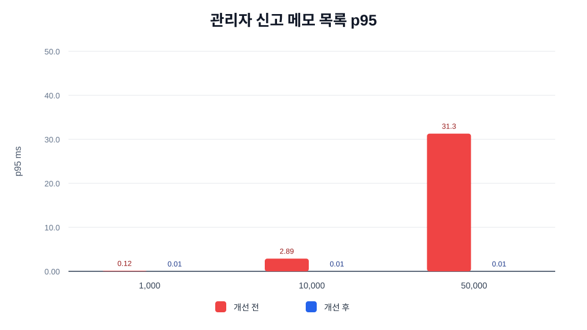
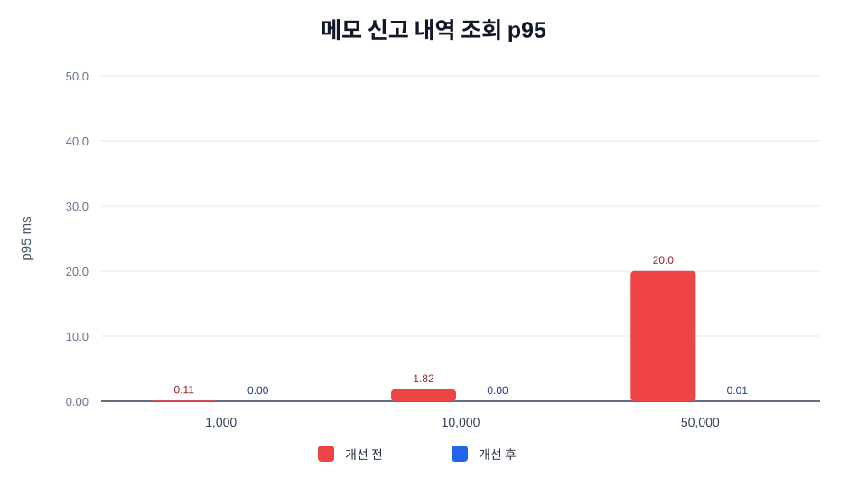
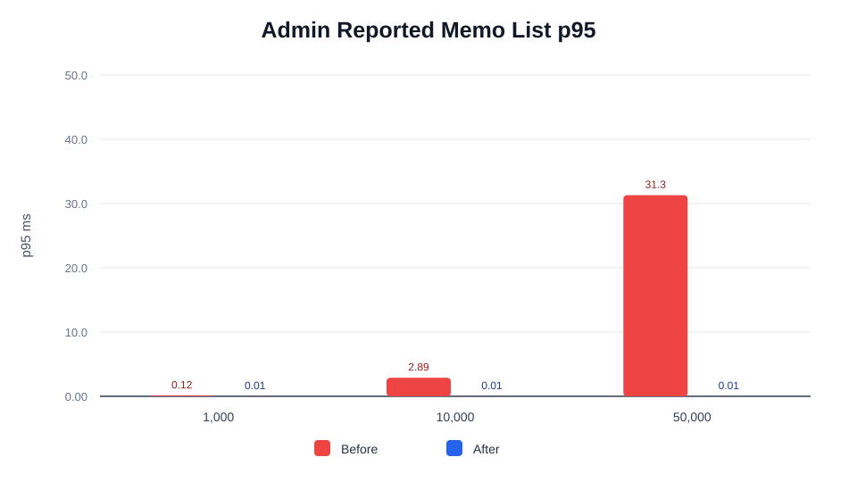
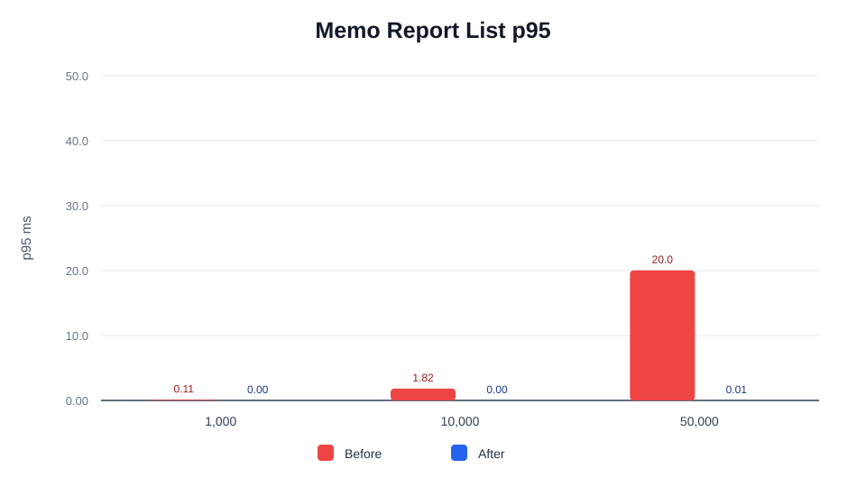
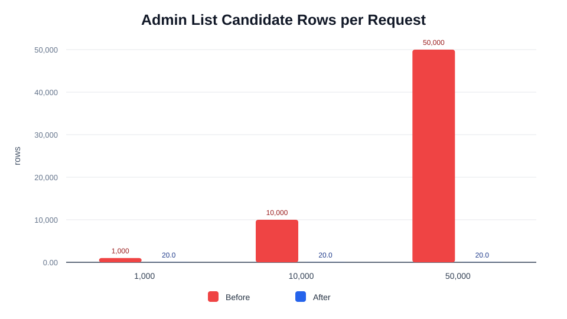

# 트러블 슈팅 7. 커뮤니티 메모 조회 인덱스 최적화 Before / After

## 요약

커뮤니티 메모는 공용 벽에 노출되는 visible 메모뿐 아니라, 숨김/삭제/신고/모더레이션 이력이 누적되는 운영 데이터입니다. 공개 벽은 `community.max_memo_count` 기본값 50개로 제한되지만, 관리자 목록과 신고 내역은 시간이 지날수록 historical row가 계속 증가합니다.

기존 구조에서 관리자 목록과 신고 내역 조회는 조건에 맞는 row를 넓게 훑고 정렬한 뒤 page를 잘라야 했습니다. V12 migration은 조회 조건과 정렬 순서에 맞춘 PostgreSQL partial/composite index를 추가해, 자주 쓰는 운영 조회가 전체 historical row가 아니라 필요한 index window를 중심으로 실행되도록 정리했습니다.

이번 문서는 이미 적용된 V12 인덱스 최적화를 포트폴리오에서 설명하기 쉽도록 before/after 수치, SVG 그래프, 재현 가능한 synthetic benchmark, k6 실행 파일로 정리한 자료입니다.

| 사용 기법 | 적용 위치 | 기대 효과 |
| --- | --- | --- |
| Partial index | visible, hidden, reported, direct/gallery 조건 | 삭제/숨김/신고 여부에 맞는 후보 row 축소 |
| Composite index | `updated_at DESC, created_at DESC, id DESC` | 관리자 목록의 최신순 정렬 비용 축소 |
| Wall order index | `z_index ASC, attached_at ASC, id ASC` | 공개 벽 렌더링 순서를 DB index 순서와 일치 |
| FIFO order index | `attached_at ASC, id ASC` | 초과 visible 메모 만료 대상 조회 비용 축소 |
| Report order index | `(memo_id, created_at DESC, id DESC)` | 특정 메모 신고 내역 최신순 조회 비용 축소 |
| Report reason index | `(memo_id, reason, created_at DESC, id DESC)` | 신고 사유 필터 조회 비용 축소 |

<br>

## 자료 위치

| 구분 | 경로 |
| --- | --- |
| 최적화 문서 | `backend/docs/performance/07-커뮤니티-메모-조회-인덱스-최적화/README.md` |
| 인덱스 migration | `backend/src/main/resources/db/migration/V12__add_community_memo_query_indexes.sql` |
| 공개 메모 조회 repository | `backend/src/main/java/com/nemonicworld/community/repository/CommunityMemoRepository.java` |
| 관리자 메모 조회 repository | `backend/src/main/java/com/nemonicworld/community/repository/AdminCommunityMemoRepository.java` |
| synthetic benchmark | `backend/scripts/benchmark-community-memo-index-performance.py` |
| benchmark 결과 | `backend/docs/performance/07-커뮤니티-메모-조회-인덱스-최적화/benchmark/` |
| k6 공개 목록 | `backend/docs/performance/07-커뮤니티-메모-조회-인덱스-최적화/k6/07-1-커뮤니티-메모-공개-목록-k6.js` |
| k6 관리자 목록 | `backend/docs/performance/07-커뮤니티-메모-조회-인덱스-최적화/k6/07-2-관리자-커뮤니티-메모-목록-k6.js` |
| 그래프 | `backend/docs/performance/07-커뮤니티-메모-조회-인덱스-최적화/graphs/` |

## 산출물 검증

| 산출물 | 파일 | 확인 내용 |
| --- | --- | --- |
| benchmark script | `../../../scripts/benchmark-community-memo-index-performance.py` | 관리자 목록, 신고 내역, 공개 벽 조회 shape before/after 재현 |
| benchmark 결과 Markdown | `./benchmark/community-memo-index-benchmark.md` | p95, 개선 배율, 후보 row 수 |
| benchmark 결과 JSON | `./benchmark/community-memo-index-benchmark.json` | 같은 실행의 원본 결과 |
| k6 실행 파일 | `./k6/07-1-커뮤니티-메모-공개-목록-k6.js` | `community_memo_public_list` endpoint tag, 공개 벽 조회 |
| k6 실행 파일 | `./k6/07-2-관리자-커뮤니티-메모-목록-k6.js` | `admin_community_memo_list` endpoint tag, 관리자 신고 메모 목록 조회 |
| 그래프 | `./graphs/*.svg` | 한국어/영어 before/after 그래프 |
| 캡처 폴더 | `./captures/` | k6 실행 후 dashboard overview, duration, terminal summary 저장 위치 |

<br>

## 최적화 대상

관련 API:

- `GET /api/v1/community/memos`
- `GET /api/v1/admin/community/memos`
- `GET /api/v1/admin/community/memos/{memoId}/reports`

관련 쿼리:

- 공개 벽: visible 메모를 `z_index ASC, attached_at ASC, id ASC` 순서로 조회
- 메모 생성 후 FIFO: 가장 오래된 visible 메모를 `attached_at ASC, id ASC` 순서로 조회
- 관리자 목록: `hidden`, `moderationStatus`, `sourceType`, `reported` 필터 후 `updated_at DESC, created_at DESC, id DESC` 순서로 조회
- 신고 내역: 특정 `memo_id`, 선택적 `reason` 필터 후 `created_at DESC, id DESC` 순서로 조회

<br>

## Before

### 관리자 목록

historical `community_memo` row가 늘어나면, 관리자 목록은 조건에 맞는 row를 찾은 뒤 최신순으로 정렬하고 page를 잘랐습니다.

```text
community_memo historical rows
-> deleted_at IS NULL
-> reported / hidden / moderation / source filter
-> updated_at DESC, created_at DESC, id DESC sort
-> LIMIT/OFFSET
```

특히 `reported=true` 또는 `hidden=true` 같은 운영 필터는 관리자 화면에서 자주 쓰이는데, 후보 row가 많아질수록 filter + sort 비용이 커질 수 있습니다.

### 신고 내역

특정 메모의 신고 내역도 최신순 정렬과 사유 필터가 함께 필요합니다.

```text
community_memo_report rows
-> memo_id filter
-> optional reason filter
-> created_at DESC, id DESC sort
-> LIMIT/OFFSET
```

<br>

## After

V12 migration에서 조회 조건과 정렬 방향을 맞춘 인덱스를 추가했습니다.

```sql
CREATE INDEX IF NOT EXISTS idx_cm_admin_reported_updated
    ON community_memo (updated_at DESC, created_at DESC, id DESC)
    WHERE deleted_at IS NULL AND report_count > 0;

CREATE INDEX IF NOT EXISTS idx_cmr_memo_reason_created
    ON community_memo_report (memo_id, reason, created_at DESC, id DESC);
```

관리자 목록은 자주 쓰는 필터별 partial index를 사용하고, 신고 내역은 `memo_id`와 `reason`을 포함한 composite index를 사용합니다. 그래서 page size 20 요청에서 전체 historical row를 정렬하는 대신 index 순서로 필요한 window를 읽는 구조가 됩니다.

```text
reported=true
-> idx_cm_admin_reported_updated
-> index order page window
-> LIMIT/OFFSET
```

```text
memo_id + reason
-> idx_cmr_memo_reason_created
-> index order page window
-> LIMIT/OFFSET
```

<br>

## Before / After 수치

아래 수치는 운영 DB 실측이 아니라 현재 쿼리 shape 차이를 재현하기 위한 synthetic benchmark입니다. 절대값보다 “데이터가 증가할 때 전체 row를 다시 훑고 정렬하는가, index window로 묶이는가”를 비교하는 용도입니다.

```bash
python3 backend/scripts/benchmark-community-memo-index-performance.py \
  --iterations 20 \
  --output-dir backend/docs/performance/07-커뮤니티-메모-조회-인덱스-최적화/graphs \
  --results-prefix backend/docs/performance/07-커뮤니티-메모-조회-인덱스-최적화/benchmark/community-memo-index-benchmark
```

측정 조건:

- page size: `20`
- 공개 벽 visible memo limit: `50`
- 관리자 목록 대표 필터: `reported=true`
- 신고 내역 대표 필터: `reason=spam`
- historical memo rows: `1,000`, `10,000`, `50,000`

| historical memo rows | Before admin reported p95 ms | After admin reported p95 ms | 개선 배율 | Before report p95 ms | After report p95 ms | 개선 배율 | Before 후보 row | After 후보 row |
| ---: | ---: | ---: | ---: | ---: | ---: | ---: | ---: | ---: |
| 1,000 | 0.12 | 0.006 | 19.99x | 0.11 | 0.004 | 29.38x | 1,000 | 20 |
| 10,000 | 2.89 | 0.005 | 542.46x | 1.82 | 0.003 | 533.00x | 10,000 | 20 |
| 50,000 | 31.30 | 0.005 | 5,777.50x | 20.03 | 0.005 | 3,815.57x | 50,000 | 20 |

> `After p95`가 매우 작게 나오는 이유는 synthetic benchmark가 DB network round trip을 제외하고 index window shape의 CPU-side 비용만 재현하기 때문입니다. 포트폴리오에서는 개선 배율보다 후보 row 수가 `50,000 -> 20`으로 줄어드는 구조 변화와 p95 증가 기울기 차이를 핵심 지표로 보는 것이 안전합니다.

### 한국어 그래프






### English Graphs







<br>

## 사용한 k6

k6는 실제 HTTP API가 관리자 인증과 응답 contract를 유지한 채 실패 없이 처리되는지 확인하는 용도입니다. before/after 구조 차이는 위 synthetic benchmark와 migration/code reference로 설명하고, k6는 현재 구현의 p95, RPS, 실패율을 캡처합니다.

| 측정 대상 | k6 스크립트 | endpoint tag | 결과 파일 |
| --- | --- | --- | --- |
| 공개 커뮤니티 메모 목록 | `./k6/07-1-커뮤니티-메모-공개-목록-k6.js` | `community_memo_public_list` | `./k6/results/07-1-커뮤니티-메모-공개-목록-k6-결과.md` |
| 관리자 신고 메모 목록 | `./k6/07-2-관리자-커뮤니티-메모-목록-k6.js` | `admin_community_memo_list` | `./k6/results/07-2-관리자-커뮤니티-메모-목록-k6-결과.md` |

### 공개 목록 실행 명령

Dashboard 캡처용:

```bash
K6_WEB_DASHBOARD=true \
K6_WEB_DASHBOARD_EXPORT=backend/docs/performance/07-커뮤니티-메모-조회-인덱스-최적화/k6/results/07-1-community-memo-public-dashboard.html \
k6 run \
  -e BASE_URL=http://localhost:8080/api/v1 \
  -e USER_UUID=$USER_UUID \
  -e RAMP_UP=5s \
  -e DURATION=30s \
  -e RAMP_DOWN=5s \
  -e VUS=10 \
  backend/docs/performance/07-커뮤니티-메모-조회-인덱스-최적화/k6/07-1-커뮤니티-메모-공개-목록-k6.js
```

터미널 상세 캡처용:

```bash
k6 run \
  -e BASE_URL=http://localhost:8080/api/v1 \
  -e USER_UUID=$USER_UUID \
  -e RAMP_UP=5s \
  -e DURATION=30s \
  -e RAMP_DOWN=5s \
  -e VUS=10 \
  backend/docs/performance/07-커뮤니티-메모-조회-인덱스-최적화/k6/07-1-커뮤니티-메모-공개-목록-k6.js
```

### 관리자 목록 실행 명령

Dashboard 캡처용:

```bash
K6_WEB_DASHBOARD=true \
K6_WEB_DASHBOARD_EXPORT=backend/docs/performance/07-커뮤니티-메모-조회-인덱스-최적화/k6/results/07-2-admin-community-memo-dashboard.html \
k6 run \
  -e BASE_URL=http://localhost:8080/api/v1 \
  -e ADMIN_TOKEN=$ADMIN_TOKEN \
  -e REPORTED=true \
  -e RAMP_UP=5s \
  -e DURATION=30s \
  -e RAMP_DOWN=5s \
  -e VUS=10 \
  backend/docs/performance/07-커뮤니티-메모-조회-인덱스-최적화/k6/07-2-관리자-커뮤니티-메모-목록-k6.js
```

터미널 상세 캡처용:

```bash
k6 run \
  -e BASE_URL=http://localhost:8080/api/v1 \
  -e ADMIN_TOKEN=$ADMIN_TOKEN \
  -e REPORTED=true \
  -e RAMP_UP=5s \
  -e DURATION=30s \
  -e RAMP_DOWN=5s \
  -e VUS=10 \
  backend/docs/performance/07-커뮤니티-메모-조회-인덱스-최적화/k6/07-2-관리자-커뮤니티-메모-목록-k6.js
```

<br>

## 결과 해석

이 최적화의 핵심은 단일 API의 평균 latency만 줄인 것이 아니라, 운영 데이터가 누적될 때 조회 비용이 historical row 수에 비례해 커지는 경로를 줄인 것입니다.

- 관리자 신고 메모 목록은 `report_count > 0` partial index로 후보 row를 좁히고 최신순 index를 그대로 사용합니다.
- 신고 내역은 `memo_id`, `reason`, 최신순 정렬을 하나의 composite index로 묶어 page window를 바로 읽습니다.
- 공개 벽은 visible memo limit 50으로 폭발적인 병목은 아니지만, 렌더링 순서와 index 순서를 맞춰 정렬 비용을 안정화합니다.
- 포트폴리오에서는 “운영 화면의 데이터 누적 병목을 쿼리 조건과 정렬 방향에 맞춘 인덱스로 줄였다”는 흐름으로 설명하기 좋습니다.

<br>

## 운영 검증 지표

실서버나 로컬 seed 환경에서 확인할 지표:

- `http.server.requests`의 `/api/v1/admin/community/memos` p95/p99
- `http.server.requests`의 `/api/v1/admin/community/memos/{memoId}/reports` p95/p99
- PostgreSQL `EXPLAIN ANALYZE`에서 `idx_cm_admin_reported_updated`, `idx_cmr_memo_reason_created` 사용 여부
- historical `community_memo` row 증가 시 관리자 목록 p95 증가 기울기
- k6 `http_req_failed`, `checks`, `http_req_duration p(95)`
