# 백엔드 성능 최적화 트러블 슈팅 문서 모음

이 문서는 지금까지 정리한 백엔드 성능 최적화 문서와 그래프 자산을 한곳에서 찾기 위한 인덱스입니다.

문서는 모두 `backend/docs/performance` 아래에 있고, 그래프는 `backend/docs/performance/assets` 아래에 있습니다. 각 상세 문서에는 그래프가 이미지로 바로 렌더링되도록 한글 버전과 영문 버전을 함께 첨부했습니다.

## 폴더 구조

```text
backend/docs/performance/
├── README.md
├── 01-외부-io-트랜잭션-분리.md
├── 02-갤러리-목록-조회-쿼리-최적화.md
├── 03-무한캔버스-조회-payload-최적화.md
├── 04-무한캔버스-요소-적용-최적화.md
├── 05-k6-부하-테스트-결과.md
├── 06-k6-부하-테스트-실행-가이드.md
├── assets/
└── k6-results/
```

## 한눈에 보기

| 구분 | 최적화 요약 | 상세 문서 | 대표 코드 / 스크립트 |
| --- | --- | --- | --- |
| 트러블 슈팅 1 | GMS, MinIO, SMTP를 긴 트랜잭션 밖으로 이동해 HikariCP 커넥션 점유 시간 축소 | `backend/docs/performance/01-외부-io-트랜잭션-분리.md` | `FortuneTransactionSupport`, `AdminInquiryCommandUseCase`, `backend/scripts/benchmark-transaction-io-performance.py` |
| 트러블 슈팅 2 | count 쿼리의 subtype JOIN 제거, page row만 subtype JOIN | `backend/docs/performance/02-갤러리-목록-조회-쿼리-최적화.md` | `GalleryRepository`, `backend/scripts/benchmark-gallery-query-performance.py` |
| 트러블 슈팅 3 | Redis Sorted Set 인덱스와 참여자 delta payload로 SCAN, 큰 JSON 전송 제거 | `backend/docs/performance/03-무한캔버스-조회-payload-최적화.md` | `RedisInfiniteCanvasRepository`, `InfiniteCanvasEventPublisher`, `backend/scripts/benchmark-infinite-canvas-performance.py` |
| 트러블 슈팅 4 | 리스트 반복 탐색을 Map 기반 batch 적용으로 변경 | `backend/docs/performance/04-무한캔버스-요소-적용-최적화.md` | `InfiniteCanvasOperationApplier`, `backend/scripts/benchmark-infinite-canvas-performance.py` |
| 트러블 슈팅 5 | 실제 HTTP 경로에서 p95, p99, RPS, 실패율 측정 | `backend/docs/performance/05-k6-부하-테스트-결과.md`, `backend/docs/performance/06-k6-부하-테스트-실행-가이드.md` | `backend/scripts/k6/*.js`, `backend/docs/performance/k6-results/*.json` |

## 문서 경로

| 문서 제목 | 파일 경로 |
| --- | --- |
| 트러블 슈팅 1. 외부 I/O 트랜잭션 분리 성능 최적화 Before / After | `backend/docs/performance/01-외부-io-트랜잭션-분리.md` |
| 트러블 슈팅 2. 갤러리 목록 조회 쿼리 최적화 Before / After | `backend/docs/performance/02-갤러리-목록-조회-쿼리-최적화.md` |
| 트러블 슈팅 3. 무한 캔버스 조회 / Payload 성능 최적화 Before / After | `backend/docs/performance/03-무한캔버스-조회-payload-최적화.md` |
| 트러블 슈팅 4. 무한 캔버스 요소 적용 로직 최적화 Before / After | `backend/docs/performance/04-무한캔버스-요소-적용-최적화.md` |
| 트러블 슈팅 5. k6 부하 테스트 실행 결과 | `backend/docs/performance/05-k6-부하-테스트-결과.md` |
| k6 부하 테스트 가이드 | `backend/docs/performance/06-k6-부하-테스트-실행-가이드.md` |

## 트러블 슈팅별 k6

| 트러블 슈팅 | 사용한 k6 | 결과 |
| --- | --- | --- |
| 트러블 슈팅 1 | `backend/scripts/k6/fortune-create-load.js`, `backend/scripts/k6/admin-inquiry-reply-load.js` | 개별 문서에 운세 생성, 문의 답변 k6 p95/RPS 표 포함 |
| 트러블 슈팅 2 | `backend/scripts/k6/gallery-list-load.js` | 개별 문서에 갤러리 목록 조회 k6 p95/RPS 표 포함 |
| 트러블 슈팅 3 | `backend/scripts/k6/infinite-canvas-active-room-load.js` | 개별 문서에 백오피스 활성 방 목록 k6 p95/RPS 표 포함 |
| 트러블 슈팅 4 | 직접 k6 없음 | 개별 문서에 k6 제외 사유와 synthetic benchmark 결과 표 포함 |
| 트러블 슈팅 5 | 전체 k6 결과 취합 | `backend/docs/performance/05-k6-부하-테스트-결과.md`에 요약 |

## 그래프 경로

### 트러블 슈팅 1. 외부 I/O 트랜잭션 분리

| 한국어 그래프 | English Graph |
| --- | --- |
| `backend/docs/performance/assets/transaction-io-connection-hold-ko.svg` | `backend/docs/performance/assets/transaction-io-connection-hold.svg` |
| `backend/docs/performance/assets/transaction-io-pool-capacity-ko.svg` | `backend/docs/performance/assets/transaction-io-pool-capacity.svg` |


### 트러블 슈팅 2. 갤러리 목록 조회 쿼리 최적화

| 한국어 그래프 | English Graph |
| --- | --- |
| `backend/docs/performance/assets/gallery-query-count-p95-ko.svg` | `backend/docs/performance/assets/gallery-query-count-p95.svg` |
| `backend/docs/performance/assets/gallery-query-list-p95-ko.svg` | `backend/docs/performance/assets/gallery-query-list-p95.svg` |
| `backend/docs/performance/assets/gallery-query-subtype-lookup-ko.svg` | `backend/docs/performance/assets/gallery-query-subtype-lookup.svg` |

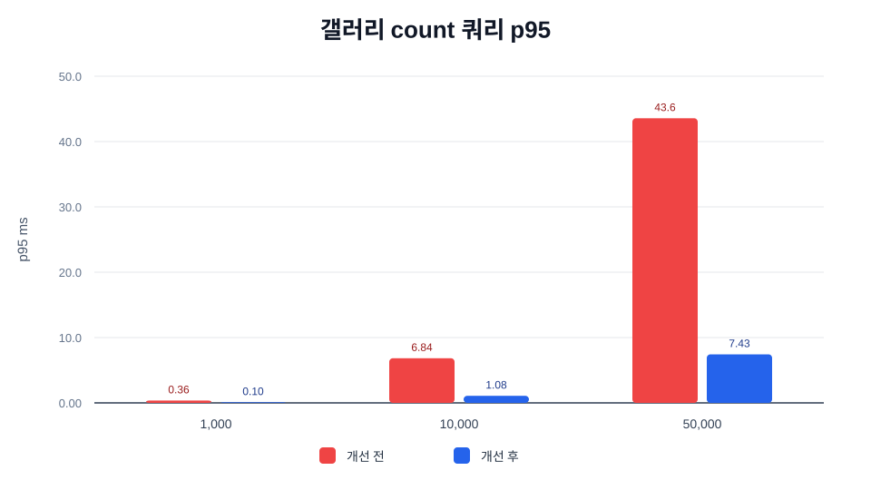


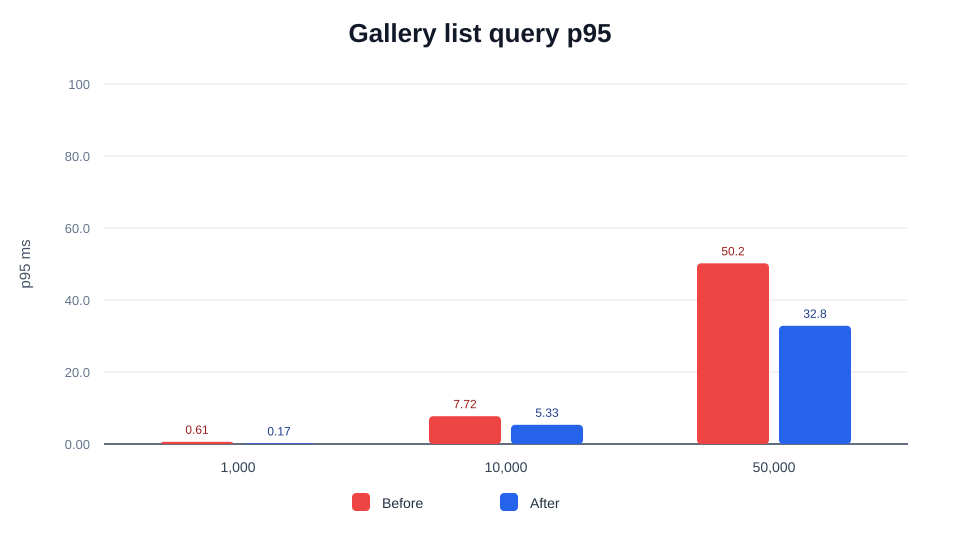


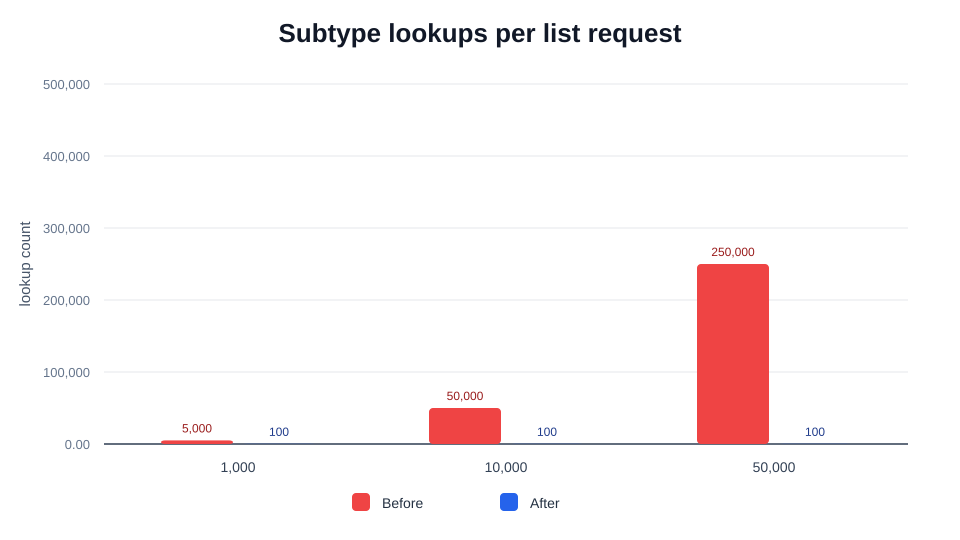

### 트러블 슈팅 3. 무한캔버스 조회 / Payload 최적화

| 한국어 그래프 | English Graph |
| --- | --- |
| `backend/docs/performance/assets/infinite-canvas-active-room-p95-ko.svg` | `backend/docs/performance/assets/infinite-canvas-active-room-p95.svg` |
| `backend/docs/performance/assets/infinite-canvas-deserialize-count-ko.svg` | `backend/docs/performance/assets/infinite-canvas-deserialize-count.svg` |
| `backend/docs/performance/assets/infinite-canvas-websocket-payload-ko.svg` | `backend/docs/performance/assets/infinite-canvas-websocket-payload.svg` |
| `backend/docs/performance/assets/infinite-canvas-json-parse-p95-ko.svg` | `backend/docs/performance/assets/infinite-canvas-json-parse-p95.svg` |

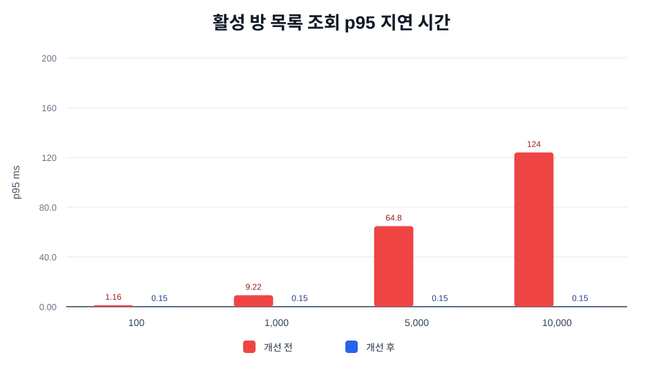

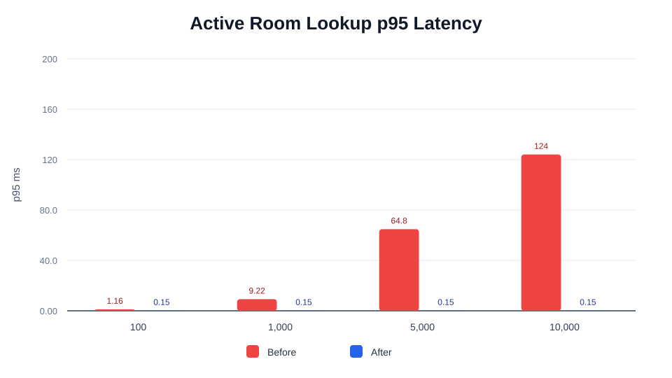

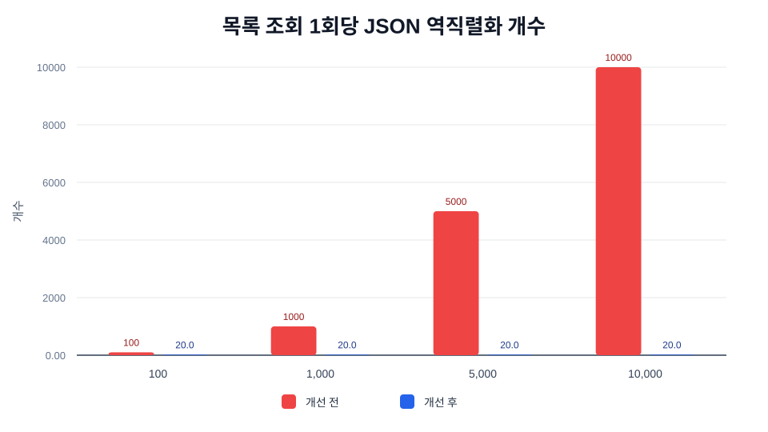

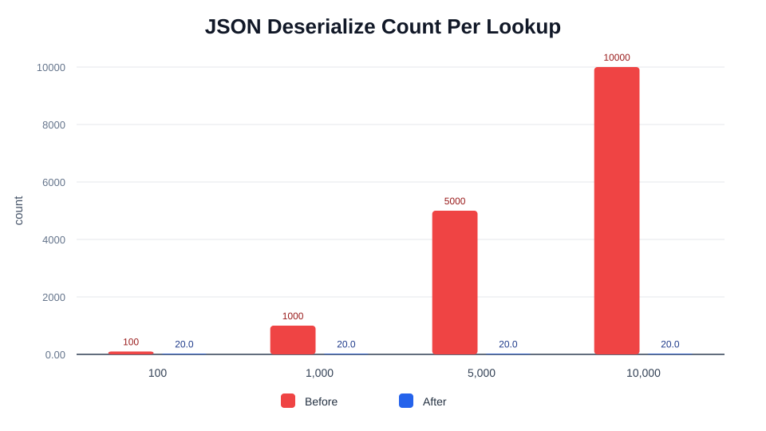

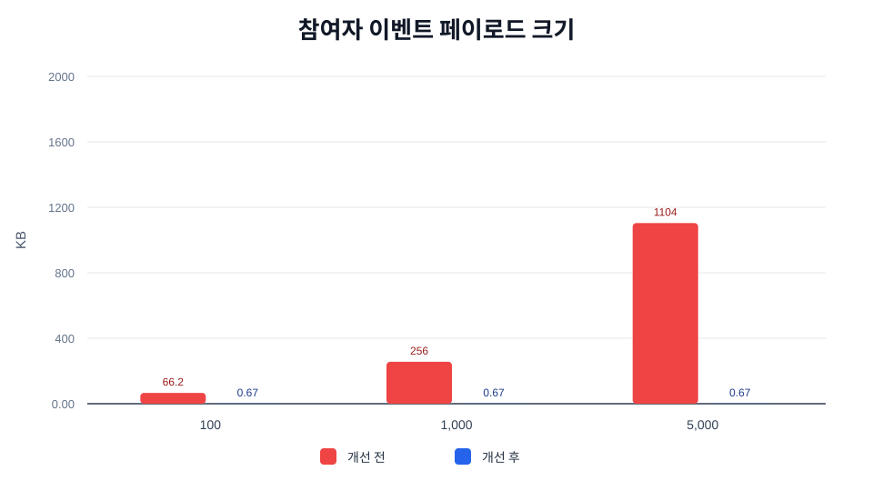

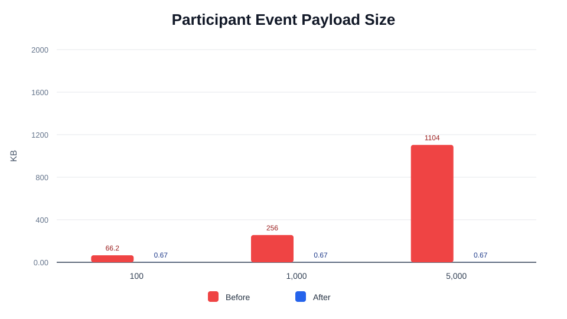

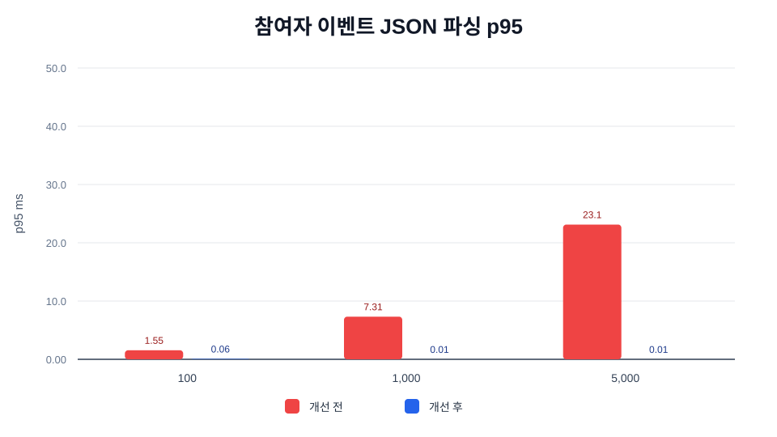

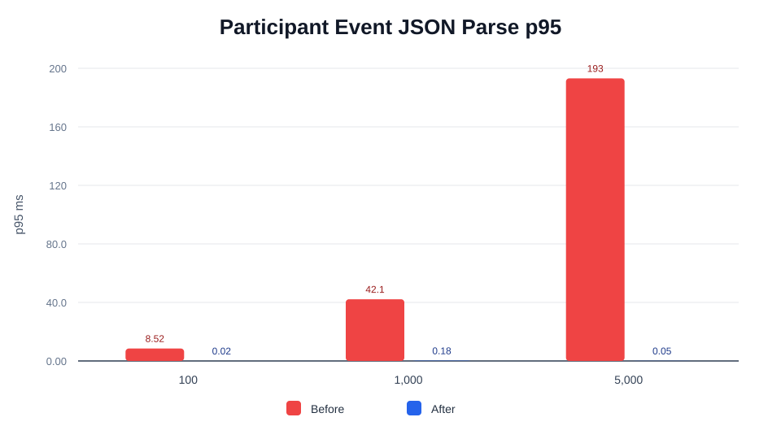

### 트러블 슈팅 4. 무한캔버스 요소 적용 최적화

| 한국어 그래프 | English Graph |
| --- | --- |
| `backend/docs/performance/assets/infinite-canvas-operation-apply-p95-ko.svg` | `backend/docs/performance/assets/infinite-canvas-operation-apply-p95.svg` |
| `backend/docs/performance/assets/infinite-canvas-operation-lookup-steps-ko.svg` | `backend/docs/performance/assets/infinite-canvas-operation-lookup-steps.svg` |


### 트러블 슈팅 5. k6 부하 테스트 결과

| 한국어 그래프 | English Graph |
| --- | --- |
| `backend/docs/performance/assets/k6-p95-latency-ko.svg` | `backend/docs/performance/assets/k6-p95-latency.svg` |
| `backend/docs/performance/assets/k6-rps-ko.svg` | `backend/docs/performance/assets/k6-rps.svg` |


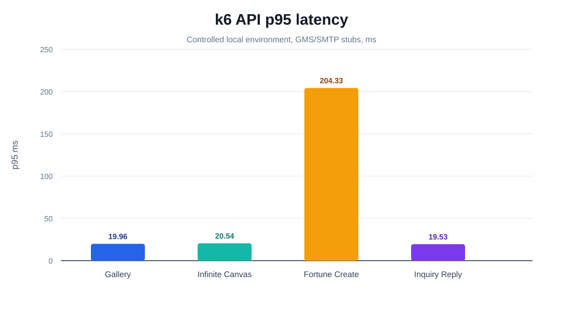


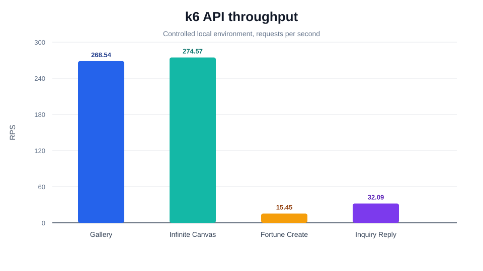

## 포트폴리오에서 바로 쓰기 좋은 수치

| 트러블 슈팅 | 대표 Before | 대표 After | 개선 |
| --- | ---: | ---: | ---: |
| 트러블 슈팅 1 | 운세 생성 GMS 30초 timeout 시 커넥션 점유 `30,024ms` | `24ms` | `99.92%` 감소 |
| 트러블 슈팅 2 | active row 50,000개 p95 `43.57ms` | `7.43ms` | `5.86x` 개선 |
| 트러블 슈팅 3-1 | active room 10,000개 p95 `124.06ms` | `0.15ms` | `834.95x` 개선 |
| 트러블 슈팅 3-2 | 요소 5,000개 payload `1,130,211B` | `682B` | `99.94%` 감소 |
| 트러블 슈팅 4 | 5,000 elements + 100 ops p95 `17.27ms` | `2.00ms` | `8.65x` 개선 |
| 트러블 슈팅 5 | 로컬 통제 환경 VU 20 | p95 `19.96ms`, RPS `268.54` | 실패율 `0.00%` |

## 참고

성능 수치는 문서마다 전제가 다릅니다. synthetic benchmark는 코드 구조상 비용 차이를 설명하기 위한 수치이고, k6 결과는 로컬 통제 환경에서 실제 HTTP 경로를 호출한 결과입니다. 운영 성능으로 발표할 때는 동일한 seed, 동일한 외부 I/O stub, 동일한 k6 옵션으로 before/after를 다시 측정해 비교하는 방식이 가장 깔끔합니다.
