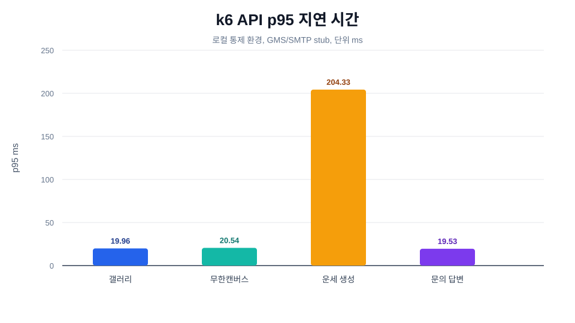
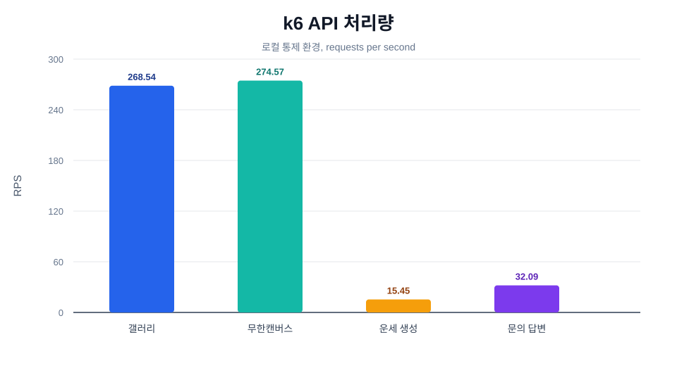

# k6 부하 테스트 실행 결과

최근 백엔드 성능 최적화 지점에 k6 부하 테스트를 적용한 결과입니다.

## 실행 환경

| 항목 | 값 |
| --- | --- |
| 실행일 | 2026-06-01 |
| 대상 | 로컬 Spring Boot 서버 `http://localhost:8080/api/v1` |
| 인프라 | Docker Compose PostgreSQL, Redis, MinIO |
| GMS | 로컬 HTTP stub |
| SMTP | 로컬 SMTP stub |
| k6 | `k6 v2.0.0` |

외부 API와 메일 서버의 네트워크 변동이 최적화 효과에 섞이지 않도록 GMS와 SMTP는 로컬 stub으로 고정했습니다. 따라서 이 결과는 운영 서버 절대 성능이 아니라, 현재 코드 경로가 로컬 통제 환경에서 안정적으로 처리되는지 확인하기 위한 HTTP 부하 테스트 결과입니다.

## Seed 조건

| 대상 | 조건 |
| --- | --- |
| 갤러리 목록 조회 | 단일 사용자 active gallery row 10,000개 |
| 무한캔버스 활성 방 목록 | active canvas 200개 |
| 운세 생성 | iteration마다 새 익명 사용자 생성 후 운세 생성 |
| 문의 답변 | iteration마다 새 익명 사용자와 문의 생성 후 관리자 답변 |

## 요약

| 시나리오 | VU | 측정 endpoint | 요청 수 | RPS | p50 | p95 | p99 | 실패율 |
| --- | ---: | --- | ---: | ---: | ---: | ---: | ---: | ---: |
| 갤러리 목록 조회 | 20 | `gallery_list` | 10,745 | 268.54 | 14.27ms | 19.96ms | 26.69ms | 0.00% |
| 무한캔버스 활성 방 목록 | 20 | `infinite_canvas_active_rooms` | 11,000 | 274.57 | 11.76ms | 20.54ms | 49.64ms | 0.00% |
| 운세 생성 | 5 | `fortune_create` | 465 | 15.45 | 162.66ms | 204.33ms | 243.67ms | 0.00% |
| 문의 답변 | 5 | `admin_inquiry_reply` | 967 | 32.09 | 13.18ms | 19.53ms | 35.20ms | 0.00% |

## 성능 그래프

## 결과 파일

| 시나리오 | Markdown | JSON |
| --- | --- | --- |
| 갤러리 목록 조회 | `backend/docs/performance/k6-results/gallery-list-load.md` | `backend/docs/performance/k6-results/gallery-list-load.json` |
| 무한캔버스 활성 방 목록 | `backend/docs/performance/k6-results/infinite-canvas-active-room-load.md` | `backend/docs/performance/k6-results/infinite-canvas-active-room-load.json` |
| 운세 생성 | `backend/docs/performance/k6-results/fortune-create-load.md` | `backend/docs/performance/k6-results/fortune-create-load.json` |
| 문의 답변 | `backend/docs/performance/k6-results/admin-inquiry-reply-load.md` | `backend/docs/performance/k6-results/admin-inquiry-reply-load.json` |

## 해석

갤러리 목록 조회와 무한캔버스 활성 방 목록은 읽기 API라 VU 20 조건에서 p95가 20ms 전후로 유지됐습니다. 갤러리 결과는 query shape 최적화 이후 실제 HTTP 경로에서도 실패 없이 높은 RPS를 처리함을 보여줍니다. 무한캔버스 결과는 Redis active-room index 기반 조회가 API p95에서도 안정적으로 동작함을 확인합니다.

운세 생성은 GMS와 MinIO 카드 업로드 경로를 포함하지만, GMS를 로컬 stub으로 고정했습니다. p95 204.33ms는 카드 렌더링, MinIO 업로드, 짧은 DB write transaction이 포함된 로컬 측정값입니다.

문의 답변은 SMTP를 로컬 stub으로 고정했습니다. p95 19.53ms는 SMTP I/O가 트랜잭션 밖에서 실행되는 현재 구조가 낮은 동시성 조건에서 안정적으로 응답함을 확인하는 값입니다.

## 실제 서버 측정 시 주의

배포 서버에 k6를 직접 실행할 수도 있지만, 운영 데이터와 실제 외부 API가 연결된 상태에서는 낮은 VU부터 시작해야 합니다. 특히 운세 생성과 문의 답변은 실제 GMS 호출, MinIO 저장, SMTP 발송 부작용이 생길 수 있으므로 staging 또는 stub 환경에서 측정하는 편이 안전합니다.
